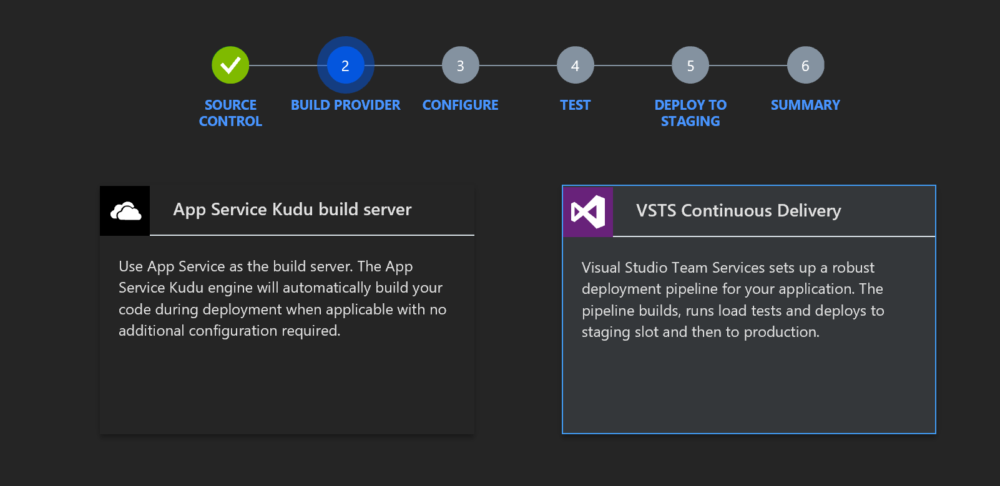
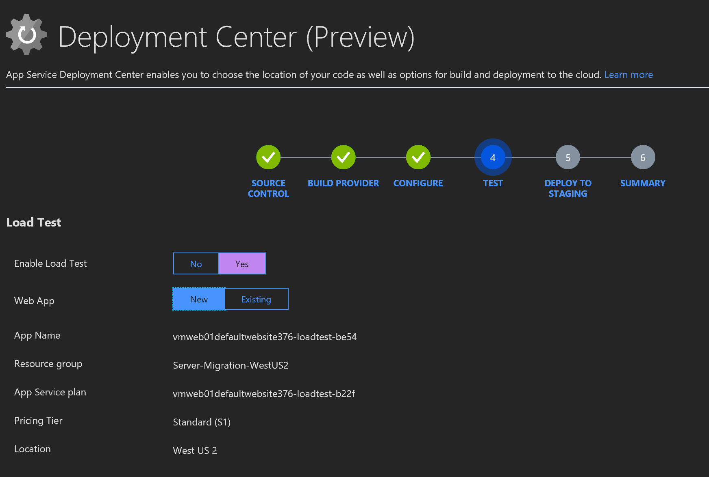

Application migration and modernization

Hands-on lab step-by-step

March 2019

Information in this document, including URL and other Internet Web site references, is subject to change without notice. Unless otherwise noted, the example companies, organizations, products, domain names, e-mail addresses, logos, people, places, and events depicted herein are fictitious, and no association with any real company, organization, product, domain name, e-mail address, logo, person, place or event is intended or should be inferred. Complying with all applicable copyright laws is the responsibility of the user. Without limiting the rights under copyright, no part of this document may be reproduced, stored in or introduced into a retrieval system, or transmitted in any form or by any means (electronic, mechanical, photocopying, recording, or otherwise), or for any purpose, without the express written permission of Microsoft Corporation.

Microsoft may have patents, patent applications, trademarks, copyrights, or other intellectual property rights covering subject matter in this document. Except as expressly provided in any written license agreement from Microsoft, the furnishing of this document does not give you any license to these patents, trademarks, copyrights, or other intellectual property.

The names of manufacturers, products, or URLs are provided for informational purposes only and Microsoft makes no representations and warranties, either expressed, implied, or statutory, regarding these manufacturers or the use of the products with any Microsoft technologies. The inclusion of a manufacturer or product does not imply endorsement of Microsoft of the manufacturer or product. Links may be provided to third party sites. Such sites are not under the control of Microsoft and Microsoft is not responsible for the contents of any linked site or any link contained in a linked site, or any changes or updates to such sites. Microsoft is not responsible for webcasting or any other form of transmission received from any linked site. Microsoft is providing these links to you only as a convenience, and the inclusion of any link does not imply endorsement of Microsoft of the site or the products contained therein.

© 2018 Microsoft Corporation. All rights reserved.

Microsoft and the trademarks listed at <https://www.microsoft.com/en-us/legal/intellectualproperty/Trademarks/Usage/General.aspx> are trademarks of the Microsoft group of companies. All other trademarks are property of their respective owners.

**Contents**

<!-- TOC -->

- [Application migration and modernization hands-on lab step-by-step](#application-migration-and-modernization-hands-on-lab-step-by-step)
  - [Abstract and learning objectives](#abstract-and-learning-objectives)
  - [Overview](#overview)
  - [Requirements](#requirements)
  - [Before the hands-on lab](#before-the-hands-on-lab)
    - [Task 1: Set up the environment](#task-1-set-up-the-environment)
    - [Task 2: Validate you can connect to the Development Environment](#task-2-validate-you-can-connect-to-the-development-environment)
  - [Exercise 1: Migration to Azure PaaS](#exercise-1-migration-to-azure-paas)
    - [Task 1: Migration Tool to Lift and Shift Application to PaaS](#task-1-migration-tool-to-lift-and-shift-application-to-paas)
    - [Task 2: Validate Application Migration](#task-2-validate-application-migration)
  - [Exercise 2: Implementing DevOps Continuous Integration / Continuous Deployment (CI/CD)](#exercise-2-implementing-devops-continuous-integration--continuous-deployment-cicd)
    - [Task 1: Add a new project to Azure DevOps and upload the code](#task-1-add-a-new-project-to-azure-devops-and-upload-the-code)
    - [Task 2: Upload Code to Git Repository in Azure DevOps](#task-2-upload-code-to-git-repository-in-azure-devops)
    - [Task 3: Use Deployment Center to create CI/CD](#task-3-use-deployment-center-to-create-cicd)
    - [Task 3 (Alternative): Use Azure DevOps to create CI/CD](#task-3-alternative-use-azure-devops-to-create-cicd)
  - [Exercise 3: Detect, Diagnose, Monitor Application Performance with Application Insights](#exercise-3-detect-diagnose-monitor-application-performance-with-application-insights)
      - [Help references](#help-references)
      - [Prerequisites](#prerequisites)
      - [Task 1: Create an Application Insights Instance](#task-1-create-an-application-insights-instance)
      - [Task 2: Update your Web Application to use Application Insights](#task-2-update-your-web-application-to-use-application-insights)
      - [Task 3: Update your application to provide more telemetry](#task-3-update-your-application-to-provide-more-telemetry)
      - [Task 4: Implement the Custom Event Telemetry Provider](#task-4-implement-the-custom-event-telemetry-provider)
      - [Task 5: Push your code to production](#task-5-push-your-code-to-production)
      - [Task 5: Review the data](#task-5-review-the-data)
      - [Task 6: Web Test](#task-6-web-test)
  - [Exercise 4: Optimize and Protect Azure Web Application](#exercise-4-optimize-and-protect-azure-web-application)
      - [Help references](#help-references-1)
      - [Prerequisites](#prerequisites-1)
      - [Task 1: Configure Backups](#task-1-configure-backups)
      - [Task 2: Configure Storage Account for Backups](#task-2-configure-storage-account-for-backups)
      - [Task 3: Schedule Backup](#task-3-schedule-backup)
      - [Task 4: Backup Database](#task-4-backup-database)
          - [Partial Backups](#partial-backups)
          - [Restore Backup](#restore-backup)
          - [Automate Backup](#automate-backup)
      - [Task 5: Viewing Health by Reviewing the Response Time and Errors](#task-5-viewing-health-by-reviewing-the-response-time-and-errors)
      - [Task 6: Setting Alerts](#task-6-setting-alerts)
      - [Task 7: Configuration App Diagnostics](#task-7-configuration-app-diagnostics)
      - [Task 8: Viewing Application CPU/Memory](#task-8-viewing-application-cpumemory)
      - [Task 9: Viewing Disk space](#task-9-viewing-disk-space)
      - [Task 10: Configuring Auto Scale Up](#task-10-configuring-auto-scale-up)
      - [Task 11: Creating an Auto Scaling Out](#task-11-creating-an-auto-scaling-out)
      - [Task 12: Prepare for scaling in another region](#task-12-prepare-for-scaling-in-another-region)
      - [Task 13: Viewing Resource Health and History](#task-13-viewing-resource-health-and-history)
      - [Task 14: View Auto Scale Run History](#task-14-view-auto-scale-run-history)
      - [Task 15: Setting up auto scaling notifications](#task-15-setting-up-auto-scaling-notifications)
  - [Exercise 5: Optimize and Secure Azure SQL Database](#exercise-5-optimize-and-secure-azure-sql-database)
      - [Help references](#help-references-2)
      - [Prerequisites](#prerequisites-2)
      - [Task 1: Resource Locking](#task-1-resource-locking)
      - [Task 2: Enable Transparent Data Encryption](#task-2-enable-transparent-data-encryption)
      - [Task 3: Scale Up Database Performance](#task-3-scale-up-database-performance)
      - [Task 4: Configure Firewall and virtual networks](#task-4-configure-firewall-and-virtual-networks)
      - [Task 5: Threat Detection and Vulnerability Assessment](#task-5-threat-detection-and-vulnerability-assessment)
      - [Task 6: Turn on SQL Server Auditing](#task-6-turn-on-sql-server-auditing)
      - [Task 7: Automatic Tuning](#task-7-automatic-tuning)
      - [Task 8: Enable Database Diagnostics](#task-8-enable-database-diagnostics)
      - [Task 9: Configure Long-term backup retention for database](#task-9-configure-long-term-backup-retention-for-database)
  - [Exercise 6: Optimize Entire Web Application Performance with Content Distributed Network (CDN)](#exercise-6-optimize-entire-web-application-performance-with-content-distributed-network-cdn)
      - [Help references](#help-references-3)
      - [Prerequisites](#prerequisites-3)
      - [Task 1: Configure CDN for the whole web application](#task-1-configure-cdn-for-the-whole-web-application)
      - [Task 2: Configure Caching Rules](#task-2-configure-caching-rules)
      - [Task 3: Improve performance by adding compression](#task-3-improve-performance-by-adding-compression)
  - [Exercise 7: Optimize Partial Web Application Performance with Content Distributed Network (CDN)](#exercise-7-optimize-partial-web-application-performance-with-content-distributed-network-cdn)
      - [Prerequisites](#prerequisites-4)
      - [Task 1: Create a Resource Group & Storage Account](#task-1-create-a-resource-group--storage-account)
      - [Task 2: Provision](#task-2-provision)
      - [Task 3: Add a CDN Endpoint](#task-3-add-a-cdn-endpoint)
      - [Task 4: Copy images to storage account](#task-4-copy-images-to-storage-account)
      - [Task 5: Integrate into web application](#task-5-integrate-into-web-application)
      - [Task 6: Explore Enhancements](#task-6-explore-enhancements)
  - [Exercise 8: Increase Application / Database Performance with Redis Cache](#exercise-8-increase-application--database-performance-with-redis-cache)
      - [Help references](#help-references-4)
      - [Prerequisites](#prerequisites-5)
      - [Task 1: Provisioning the Redis Cache Service](#task-1-provisioning-the-redis-cache-service)
      - [Task 2: Improve Session Performance](#task-2-improve-session-performance)
      - [Task 4: Speed Up Output and Reduce Memory Footprint](#task-4-speed-up-output-and-reduce-memory-footprint)
      - [Task 5: Reducing database utilization](#task-5-reducing-database-utilization)
  - [Exercise 9: Improve Quality & Performance of Search with Azure Search](#exercise-9-improve-quality--performance-of-search-with-azure-search)
      - [Help references](#help-references-5)
      - [Prerequisites](#prerequisites-6)
      - [Task 1: Create Azure Search Service](#task-1-create-azure-search-service)
      - [Task 2: Configure Azure Search](#task-2-configure-azure-search)
      - [Task 3: Integrate search into application](#task-3-integrate-search-into-application)
      - [Task 4: Verify Search Results](#task-4-verify-search-results)
      - [Task 5: Commit & Sync Code](#task-5-commit--sync-code)
  - [Exercise 10: Accelerate development and take advantage of serverless using Azure Functions](#exercise-10-accelerate-development-and-take-advantage-of-serverless-using-azure-functions)
      - [Help references](#help-references-6)
      - [Prerequisites](#prerequisites-7)
      - [Task 1: Refactor](#task-1-refactor)
      - [Task 2: Modernize](#task-2-modernize)
          - [GlobalConfiguration.cs](#globalconfigurationcs)
          - [GetCategories.cs](#getcategoriescs)
          - [BrowseCategory.cs](#browsecategorycs)
          - [GetProductDetails.cs](#getproductdetailscs)
      - [Task 3: Integrate](#task-3-integrate)
      - [Task 4: Publish the Service](#task-4-publish-the-service)
      - [Task 5: Configure Function Database Connection](#task-5-configure-function-database-connection)
      - [Task 5: Configure Function Application Insights](#task-5-configure-function-application-insights)
      - [Task 6: Modify App Service CI/CD Task](#task-6-modify-app-service-cicd-task)
  - [Exercise 11: Monetize your data and services, and open new channels to customers using Azure API Management](#exercise-11-monetize-your-data-and-services-and-open-new-channels-to-customers-using-azure-api-management)
    - [Task 1: Create Azure API Management](#task-1-create-azure-api-management)
    - [Task 2: Set up new a new API in the Azure Portal](#task-2-set-up-new-a-new-api-in-the-azure-portal)
      - [Task 3: Enable Application Insights](#task-3-enable-application-insights)
      - [Task 4: Explore the API Management (APIM) Developer Portal](#task-4-explore-the-api-management-apim-developer-portal)
  - [After the hands-on workshop](#after-the-hands-on-workshop)
      - [Task 1: Delete the Resource Group in which you placed your Azure resources.](#task-1-delete-the-resource-group-in-which-you-placed-your-azure-resources)

<!-- /TOC -->

# Application migration and modernization hands-on lab step-by-step

## Abstract and learning objectives

Migrate and modernize legacy on-premises applications and infrastructure by
leveraging several cloud services, while adding a mix of modern services.

Learning Objectives:

- Use Azure App Services
- Implement Continuous Integration & Delivery with Azure DevOps
- Detect, Diagnose, Monitor Application Performance with Application Insights
- Optimize & Protect Azure Web Application
- Optimize & Secure Azure SQL Database
- Optimize Entire Web Application Performance with Content Distributed Network (CDN)
- Optimize Partial Web Application Performance with Content Distributed Network (CDN)
- Increase Application / Database Performance with Redis Cache
- Use Search to make content full text searchable
- Accelerate development and take advantage of serverless using Azure Functions
- Monetize your data and services, and open new channels to customers using Azure API Management

## Overview

The App Modernization hands-on lab is an exercise that will challenge you to implement an end-to-end migration and modernization scenario using a supplied sample that is based on Microsoft Azure App Services and related services. The scenario will include implementing compute, storage, security, and search, using various components of Microsoft Azure. The hands-on lab can be implemented on your own, but it is highly recommended to pair up with other members at the lab to model a real-world experience and to allow each member to  share their expertise for the overall solution.

## Requirements

1. Microsoft Azure subscription (non-Microsoft subscription)
2. **Global Administrator role** for Azure AD within your subscription
3. Local machine with Remote Desktop installed

## Before the hands-on lab

**Duration**: 30 minutes

In this exercise, you will set up your environment for use for the rest of the exercises. This will involve downloading the assets from the repository and deploying them to Azure. We will use your workstation to set up the environment and connect to Virtual Machines via Remote Desktop.

### Task 1: Set up the environment

1.  Open your browser to https://aka.ms/appmodernization
2.  Click on the **Deploy to Azure** button

    

3.  Select an **Azure Subscription**
4.  Create a new **Resource Group**
5.  Chose the **East US** location

    

6.  Accept the terms and conditions
7.  Click on the **Purchase** button

    

**Exit criteria**

- Initiate the environment deploy from the repository
- Verify the website runs in Azure (IaaS)
- Note the URLs of the provisioned web for future reference
- Save the database connection string for later

**References**

- [Azure Resource Manager Templates]([https://azure.microsoft.com/en-us/resources/templates/](https://docs.microsoft.com/en-us/azure/azure-resource-manager/resource-group-overview#template-deployment))
- [Azure Quickstart Templates](https://azure.microsoft.com/en-us/resources/templates/)
- [Azure Virtual Machine Extensions](https://docs.microsoft.com/en-us/azure/virtual-machines/extensions/features-windows)
- [PowerShell Desired State Configuration](https://docs.microsoft.com/en-us/powershell/dsc/overview/overview)
- [PowerShell Gallery](http://www.powershellgallery.com/)

**Default Settings**

- VM Admin User Name: sysadmin  
- VM Admin User Password: Password$123
- Database Login Name: workshopServiceAcc  
- Database User Name: workshopServiceAcc  
- Database User Password: P2ssw0rd
- Database Name: partsUnlimitedDB

**Note**: if you don't have a Visual Studio Enterprise License, please select the community edition for the Dev Workstation OS Version.

**Note:** Do not modify the values for **\_artifacts Location** or **\_artifacts Location SAS Token**.

  

Clicking on the tile will show you deployment information and status. This shows all the parameters that were used as part of your deployment, and at the bottom of the blade, will show you the deployment status:

  

Refreshing the blade will update the deployment status.  The deployment will first create the vNet, then the web and SQL servers in parallel, and finally create the developer workstation and deploy the app. The entire process should take between 18 and 25 minutes.

You can navigate away from this page and review the resource group. In the top right of the resource group, you will also see deployment information.

  

Clicking this link will take you to the list of completed and active deployments

  

Once the deployment is complete, review the vmweb01 configuration to find the public URL.  Copy the URL, open a browser, and paste and go to verify that everything worked correctly.

  

You should see the Parts Unlimited web site launch like below.

  

### Task 2: Validate you can connect to the Development Environment

Now that the environment is set up, we need to make sure we can connect to the development environment where we will be doing the exercises for this workshop.

1. Verify connectivity to the development virtual machine
2. Sign in to Visual Studio
3. Remote into the vmdev01 using the User Name and Password used when creating the environment.

    

4. Click **“Sign In”**. Type your Microsoft Account or Corporate Account, whichever account name you use for your Visual Studio Subscription (MSDN).

    

5. Open the Solution which is located at **C:\\Source\\AppWorkshop\\IaaS2PaaSWeb\\IaaS2PaaSWeb.sln**

Write the values defined during the setup:

Web Site URL: \_\_\_\_\_\_\_\_\_\_\_\_\_\_\_\_\_\_\_\_\_\_\_\_\_\_\_\_\_\_\_\_

VM User Name: \_\_\_\_\_\_\_\_\_\_\_\_\_\_\_\_\_\_\_\_\_\_\_\_\_\_\_\_\_\_\_\_

VM User Name Password: \_\_\_\_\_\_\_\_\_\_\_\_\_\_\_\_\_\_\_\_\_\_\_\_\_\_\_\_\_\_\_\_

While this is just the initial setup process, note that everything has been automated using a combination of Azure Resource Management Templates, PowerShell, and PowerShell DSC. This technique can be used to support a DevOps process even if you are deploying to IaaS based environments.

## Exercise 1: Migration to Azure PaaS

**Duration**: 30 minutes

Parts Unlimited is in the auto part business. They typically sell via a brick and mortar store but have invested in a small e-commerce presence to augment those stores. They have seen an uptick in use from customers and have been getting some complaints about the speed of the site and requests for additional features and functionality.

Parts Unlimited would like to expand and improve their ecommerce presence, experiment with new features and business strategies to help grow the business. However, they are not interested in sinking large sums of money into hardware and the management of that hardware. They want to quickly spin something up to see how it works, scale it if it
does, and deprovision it if it doesn’t. They also want more flexibility in how they scale their solutions given the seasonal nature of what they do.

Currently, Parts Unlimited consists of an ASP.NET 4.5.1 website running on Microsoft Windows 2016 and SQL database running on Microsoft SQL 2016. You need to migrate that application to a Microsoft Azure App Service Web Site and a Microsoft SQL Azure Database.

With the website migrated, you immediately gain new capabilities that you can use to improve your site and accelerate business value:

- Deployment Slots
- Testing in Production
- Scale up / Scale out
- Authentication Support for Azure AD, Facebook, twitter, etc.
- Diagnostic Tools
- Security Center
- No OS to manage or patch

These features setup Parts Unlimited for future enhancement and scale without having to plan for and manage infrastructure.

**References**

- [App Service Overview](https://docs.microsoft.com/en-us/azure/app-service/app-service-web-overview)
- [Migration to Azure](https://www.migratetoazure.net/)
- [Azure SQL Database](https://docs.microsoft.com/en-us/azure/sql-database/)

### Task 1: Migration Tool to Lift and Shift Application to PaaS

In this exercise, you will use migration tool to lift and shift application to PaaS.

1. Connect to the **vmweb01** virtual machine

    

2. When you first connect, Server Manager will open.  To make is simpler to browse the web, let's turn off IE Enhanced Security.
   1. Click on Local Server.  You will see an option for IE Enhanced Security, click it

    

   2. Toggle both to Off

    

3. Install the following component using Microsoft Web Platform Installer:

    

   1. SQL Server Shared Management Objects
   2. SQL Server Data-Tier Application Framework (DACFx)
4. Install the Azure App Service Migration Assistant tool for Windows 
   1. Browse to <http://www.migratetoazure.net/>

    

   2. Switch to the **Windows Tool** tab an click on **Install Tool**

    

   3. You will be presented with a security warning, click install to continue.

    

   4. You will then be asked to run the file, click Run to continue.

    

5. Run the Azure App Service Migration Assistant
   1. Choose the first option, **migrate sites and databases on the local server to Azure and click continue**

    

    > **Note**: The tool will quickly scan your IIS server to pick up any websites that are migration candidates and the corresponding connection strings.  You can select what you want to migrate, then click next.

   2. Select the default site and click on **Next**

    

    > **Note**: You will be presented with a Readiness Report.  You can upload this for analysis or save for later.

   3. Preview readiness report and click **Upload** to check if your site is ready to be migrated.

    

   4. Check the results of the assesment

    

   5. If everything looks good, click on **Begin Migration**
   6. Provide the credentials to connect with Azure
   7. Once signed in, provide **tenant**, **subscription** and **resource group name** and click **Start Migration**

    

   8. In this step, the tool will ask you to use an existing Azure SQL Server or create a new one, select the websites to migrate, as well as other configuration details.

    

    > **Note**: Use the admin user and password that you used for the server and the same name for the database that you used when you created the environment

    

   9. Click on **Create** to create the services

    

   10. Click on **Begin Publish** to publish site and database

    

   11. Click on the link to verify the application is running

    

**Exit criteria**

- Azure App Service instances should be created with the application
- Note the URLs of the provisioned web for future reference
- Save the new database connection string for later

### Task 2: Validate Application Migration

After a few minutes, your site and content will be ready to go.  Click the link to view your site.

Ask yourself: How did the web site connect to the database? Did the migration tool modify the Web.Config file with the new database? We’ll answer that below.

Go back to the Azure portal and look at the Resource Groups.  You will see a new Resource Group called "Server-Migration-\<location\>." or the name you entered in the migration tool.


Navigate into the resource group to inspect the services that were created.


You should have 4 items:

- SQL Server
- SQL Database
- App Service Plan
- App Service

Click the web app and then click app settings so we can have a look at what was created.


Notice there are lots of options, we will be discussing them throughout this workshop.  However, note the connection string.  The App Service will override application settings defined in your Web.Config, making it easy to manage and secure.

Go back to the resource group and click on the App Service Plan.  The app service plan defines the infrastructure your app is hosted on. Scale Up defines the instance size you are running on and scale out defines the number of instances.


## Exercise 2: Implementing DevOps Continuous Integration / Continuous Deployment (CI/CD)

**Duration**: 45 minutes

Parts Unlimited wants to improve their deployment process to enable more agility. Currently, Parts Unlimited has a very manual deployment process. Developers document the install steps and operations performs the deployment. This process worked when they pushed code only a few times a year. However, the goal is to rapidly deliver value in days as opposed to months.

Currently, there is no automated deployment process.  has been chosen as the ALM/DevOps platform moving forward. You will implement a CI/CD process from Team Services to Azure. Once the CI/CD process is in place you can quickly deploy changes to production with full traceability. The automation not only shortens your delivery time, it also dramatically improves the repeatability. Additionally, you can add unit testing, automated UI testing, Load Testing, Manual Testing, approval processes, etc. to ensure you do not sacrifice quality for speed.

**References**

- [Azure DevOps Services](https://www.visualstudio.com/team-services/)               - [Azure DevOps Services CI/CD](https://docs.microsoft.com/en-us/azure/virtual-machines/windows/tutorial-vsts-iis-cicd)
- [Azure DevOps Services Creation](https://docs.microsoft.com/en-us/vsts/accounts/create-account-msa-or-work-student?view=vsts)

**Prerequisites**

You must also have a Azure DevOps Services Account and be able to create new projects within that account. If you don’t, you will need to [Setup a new Account](https://app.vsaex.visualstudio.com/go/signup?account=true&campaign=o~msft~vsts~orghome).

**Note**: Setup Azure DevOps with the same user account you use to log into the Azure Portal.  If you do not, the CI/CD wizard will not find your subscription automatically\!

### Task 1: Add a new project to Azure DevOps and upload the code

- Create Team Services Project and upload code
- Use Quick DevOps capabilities out of portal
- Verify build/release process
- Add deployment slots
- Update release to use deployment slots
- Verify release

1. Once you have a Azure DevOps subscription setup, log into your tenant and create a new project:

    

2. Give your project a name, make sure you have Git as your version control system, and click create.

    

3. In a few moments you will have a new project provisioned for you.  You are now ready to upload code.

    

4. Next, we are going to change the origin of our Git repo and push an it to Azure DevOps.  If not already visible, you can navigate to the **Repos \> Files** of Azure DevOps where you will be presented with the commands (with some small changes) to push the code to the repo.  This will be specific to your Azure DevOps subscription and your project name so type in what Azure DevOps shows you.

    

### Task 2: Upload Code to Git Repository in Azure DevOps

1. Connect via Remote Desktop to the **vmdev01** virtual machine using the User Name and Password provided when creating the environment.

    

    > **Reminder**:
    >
    > Default Admin: sysadmin
    >
    > Default Password: Password$123

2. Open a command prompt and execute the following commands:

    ```Bash
    C:\windows\system32> cd C:\Source\AppWorkshop
    C:\Source\AppWorkshop> git remote set-url origin <REPO URL>
    C:\Source\AppWorkshop> git push -u origin --all
    ```

    **Note**: 

    > 

The command will look like git remote set-url origin
**https://rissland……**..

Type in the command and hit enter to change the origin from GitHub to
Azure DevOps

Next, execute **git push -u origin --all**

You’ll be prompted for your credentials.

> 

After you have entered your credentials, your commit will be pushed to
Azure DevOps

> 

Once you entered the commands, refresh the browser.  You should now see
the workshop code in your Azure DevOps repository.

>  
> 
> 

### Task 3: Use Deployment Center to create CI/CD

Go back to the Azure portal and open the Azure App Service Web Site you
created when you used the Migration Tool. It will be in the
Server-Migration-XXXX Resource Group.

You will want to pick the "Deployment Center (Preview)”

> 

Next, you will see an overview page, click Azure DevOps

> 

Next, you’ll have a choice of Build Providers, App Service Kudu build
server or Azure DevOps Continuous Delivery.

> 

 Click on **Azure DevOps Continuous Delivery**

Configure where the source code is located and which Web Application
Framework to use for your Build

> 

**Note**:

If you don't click on each dropdown, the OK button won't enable.

> 

While you can setup Load Testing here, we are going to leave this option
set to On change leave the default values.

Web apps have a feature called deployment slots.  This helps you deploy
to a test environment prior to going to production.  We are going to
click Yes and let the wizard set this up for us.

> 

Click yes, choose to create a **New** Deployment Slot, and name the slot
'Staging'

>  
> 
> 

 

Click Continue

You should see a summary like the following:

> 
> 
>  

Verify the configuration and then click **Finish**.

The service will trigger a Build in Azure DevOps, create a new Web Application
for Test environment and create a new staging Slot.

This process may take a few minutes. When its complete, you’ll see a
summary screen like the following:

> 

Going back to Azure DevOps, click on Build and Release, then click on Builds. 
You should see the build definition that was generated for you.

> 
> 
>  

Next, click on the Releases tab to see the release that was generated
for you.

> 
> 
>  

After a little time, the release should complete.

 

**Note**:

Looks like there is a bug in the migration tool.  It doesn't property
put the connection string in the app settings correctly. Remember how we
fixed this before?

>  
> 
> ![C Secure https://vmweb01defaultwebslte.azurewebsites.net Server
> Error in '/' Application. Runtime Error Description: An application
> error occurred on the server The current custom error settings for
> this application prevent the de could, hwever, be viewed by browsers
> running on the local server machine. Details: To enable the details of
> this specific error message to be viewable on remote machines, please
> create a \<custom current web application. This tag should then have
> its "mode" attribute set to "Offt](images/media/image70.jpeg)
> 
>   

**Note**: This is an opportunity to see how you can troubleshoot the
environment using Kudu, diagnostics, deployment slots, etc. Navigation
with your web browser to https://\[webname\].scm.azurewebsites.net.

To Avoid the error……….

Note that the name of the connection string is
"DefaultConnectionString", which we captured before starting the CI/CD
pipeline creation.

> 
> 
>  

When the migration tools moved the application, it doesn't correctly add
the connection string name.  Note that the connection string is simply
"DefaultConnection"

> 
> 
>  

To avoid an error, simply edit the connection string name in both the
production website and the staging slot to read
"DefaultConnectionString" and save your settings. For the Database, use
**SQLAzure**.

**Note**:

If you’re using Azure DevOps, consider managing ConnectionString values in
Release using the appropriate task.

### Task 3 (Alternative): Use Azure DevOps to create CI/CD 

Go back to the Azure portal and open the Azure App Service Web Site you
created when you used the Migration Tool. It will be in the
Server-Migration-XXXX Resource Group.

**Part A - Setup A Deployment Slot**

Open the Server-Migration-\*\*\*\* resource group and click on the web
application

 


 

 

In the web application, click on Deployment Slots

 

![Home \> Resource groups \> Server-Migration-EastUS2 \>
vmwebOIDefauItWebSite679 vmweb01DefaultWebSite679 App Service Search
\[Ctrl Ove rview Activty log Access control (IA M) Tags Diagnose and
solve problems DEPLOYMENT Quickstart Deployment credentials Nii
Deployment slots Deployment options c Deployment Center (Preview) Browse
Stop Resource group Server-Migration-EastUS2 Status Running Location
East US 2 Subscription Swap Restart Microsoft Azure Internal Consumption
Subscription ID 4126860-242b-452c-8273-a4da78837adc Diagnose and solve
problems Our and with Http 5xx ](images/media/image74.jpeg)

 

 

At this time, there are no deployment slots configured for your
website.  A deployment slot is used to setup a staging environment for
your application, so you can test new changes easily prior to rolling
them to production.

Click the Add Slot option to add a new deployment slot.


 

On the "Add a Slot" dialog, name the slot "staging" and choose the
configuration source as the current production slot, then click ok.

 


 

When done, you should have a new deployment slot named "staging".

 


 

**Part B - Setup CI/CD**

Open your new Team Services Account \*\*\*\*.VisualStudio.Com and view
the "Overview".  You should be presented with summary information about
your project with a very prominent "Set up Build" Button….. Click it.

 


 

The Next Dialog will ask you to choose where your source code is, your
project, repository, and branch.  These options should be defaulted to
the correct values.  Click continue.

 


 

The next dialog will present you with a few canned build templates. 
Select the Azure Web App for ASP.NET template and click Apply.

 

![karlriss Workshop0717
https://karlriss.visualstudio.com/Workshop0717/\_apps/hub/ms.vss-ciworkflow.build-ci-hub?
a Build and release Select a template Or start with an Empty process
Featured .NET Desktop p Search Choose a template Choose a template that
builds your kind of app. Don't worry if it's not an exact match; you can
add and customize the tasks later, Build and test a .NET or Windows
classic desktop solution. Android Build, test, sign, and align an
Android APK. ASP.NET Build and test an ASP.NETweb application. Azure Web
App for ASP.NET Build, package, test, and deploy an ASP.NET Azure Web
App. Docker container Build a Docker image and push it to a container
registry. Maven Build and test a Java project with Apache Maven. Apply
](images/media/image80.jpeg)

 

 

Next, you will be shown the build process with some options that need to
be configured.  First, in the "Azure Subscription" drop down, pick the
Azure subscription which is hosting your migrated web application and
then click the "Authorize" button.

 

![karlriss Workshop0717 / Build and release Workshop0717-Azure Web A \>
OTasks Variables OTriggers Options Process O Some settings need
attention Retention History Name \* El Save queue Discard ¯ Summary Get
sources workshop0717 Phase 1 Run on agent p master Workshop0717-Azure
Web App for ASP.NET-CI Agent queue\* O Hosted VS2017 Parameters O
Solution Azure subscription Pool information I Manage Qa Unlink all I
Manage CD Use NuGet 4.4.1 NuGet Tool Installer NuGet restore Build
solution Visual Studio Build VsTest - testAssemblies Visual Studio Test
Azure App Sewice Deploy: OSome settings need attention Publish symbols
path Index Sources & Publish Symbols Publish Artifact: drop Publish auld
Artifacts Microsoft Azure Internal Consumption (412b C) Click Authorize
to configure an Azure sevice connection This field is linked to I
setting in 'Azure App Service Deploy. App service name \* c" C) This
setting is required. CD Authorize ](images/media/image81.jpeg)

 

 

**Note:** It is assumed that you are using the same login for your Azure DevOps
account and your azure subscription.  If this is not the case, the Azure
subscription may not be shown in the drop down and you will need to
manually add it to Azure DevOps.  If this is the case, simply ask your
instructor or proctor to assist you.  Should take no more than a few
minutes to setup.

 

Once the subscription has been Authorized, Azure DevOps is able to enumerate the
App Services in your subscription and populate the drop down.  Simply
pick the App Service you wish to deploy to.

 

![karlriss Tasks / Workshop0717 Build and release Workshop0717-Azure Web
A \> Variables OTriggers Options p master Retention History Name \* El
Save queue Discard ¯ Summary Process Build process Get sources
Workshop0717 Phase 1 Run on agent Workshop0717-Azure Web App for
ASP.NET-CI Use NuGet 4.4.1 NuGet Tool Installer NuGet restore Build
solution Visual Studio Build VsTest - testAssemblies Visual Studio Test
Azure App Sewice Deploy: vmw... Azure App Service Deploy Publish symbols
path Index Sources & Publish Symbols Publish Artifact: drop Publish auld
Artifacts Agent queue\* O Hosted VS2017 Parameters O Solution Azure
subscription Pool information I Manage Qa Unlink all I Manage CD CD
Microsoft Azure Internal Consumption (412b86d9-242b-452c-8Z This field
is linked to I setting in 'Azure App Service Deploy. App service name \*
c" vmweb01DefauItWebSite679 CD This field is linked to I setting in
'Azure App Service Deploy. ](images/media/image82.jpeg)

 

One last setting.  Notice that the "Triggers" tab is showing an error. 
Click the triggers tab and select your master branch.

 


 

 


 

 

Lastly, save and queue your build to verify it works correctly.

 


 

 

Add a comment to note the changes made to the build definition and click
the "Save & Queue" button.


 

 

You will see that the build was successfully saved and a new build has
been queued.  Click the new build link so you can watch the progress.

 

![karlriss O Tasks / Workshop0717 Build and release Workshop0717-Azure
Web App for A \> ild \#20180718.1 has been ueued. Variables Triggers
Options Retention History Save queue c,) Discard Summary Queue
Continuous integration Workshop0717 Enabled Scheduled No builds
scheduled Build completion Build when aru'ther build completes
Workshop0717 Enable continuous integration Batch changes while a build
is in progress .4- Add Add Branch filters Type Include + Add Path
filters + Add Branch specification P master fi
](images/media/image87.jpeg)

 

 

Clicking on the "Logs" tab will let you review detailed, real time,
build information.

 

![O karlriss Logs Workshop0717 / Build and release Workshop0717-Azure
Web App for ASP.NET-CI 20180718.1 Workshop0717 • master . O Add tag
ad56a29 : Update WorkshopEnv.parameters.json . Manual build Timeline
Code coverage\* Tests Database diff report Database script Edit O Stop
build Phase 1 Job Agent: Hosted Agent v/ v/ Initialize agent • succeeded
Initialize job • succeeded Get sources Started: 7/18/2018 7:43 PM é
39.865 52.273 14.360 é 24.489 Receiving Receiving Receiving Receiving
Receiving Receiving Receiving Receiving Receiving Receiving Receiving
Receiving Receiving Receiving Receiving Receiving objects : objects :
objects : objects : objects : objects : objects : objects : objects :
objects : objects : objects : objects : objects : objects : objects : 1
ex (55/1811) (73/1811) (91/1811) (109/1811) (127/1811) (145/1811)
(163/1811) (182/1811) (20€/1811) (218/1811) (236/1811) (254/1811)
(272/1811) (29e/1811) (308/1811) (326/1811) ](images/media/image88.jpeg)

 

 

![karlriss Workshop0717 Build and release Workshop0717-Azure Web App for
ASP.NET-CI 20180718.1 Workshop0717 . X-D master . ad56a29 : Update
WorkshopEnv.parameters.json . Manual build O Add tag Logs Timeline Code
coverage\* Tests Database diff report Database script \[i\] Artifacts v
Create release Edit Queue Phase 1 Job Queue: Hosted VS2017 Initialize
phase Initialize agent • Initialize job • succeeded Get sources •
succeeded use nuget 4.4.1 • succeeded Nuget restore • succeeded Build
solution • succeeded 1 warning Vstest - testassemblies • succeeded 2
warnings Azure app ser.•ice deploy: vmweb01 defaultwebsite679 Publish
symbols path • succeeded Publish artifact: drop • succeeded Post job
cleanup • succeeded Report build status • succeeded • Agent: Hosted
Agent • succeeded succeeded • succeeded Started: 7/18/2018 7:43 PM
3:33.360 0.000 52.273 14.360 27.190 11.787 1:12.387 41.183 1.650 31.383
7.624 4.226 0.087 0.127 ](images/media/image89.jpeg)

 

**Part C - Leverage the Deployment Slot and implementing a Release**

While we are deploying our application as part of a build, it may be a
better option to leave the creation of artifacts to the build and move
deployment of said artifacts to a release.  To quickly create a new
release, click the "Create Release" option.

 

![karlriss Workshop0717 Build and release Workshop0717-Azure Web App for
ASP.NET-CI 20180718.1 Workshop0717 . X-D master . ad56a29 : Update
WorkshopEnv.parameters.json . Manual build O Add tag Logs Timeline Code
coverage\* Tests Database diff report Database script \[i\] Artifacts v
Create release Edit Queue Phase 1 Job Queue: Hosted VS2017 Initialize
phase Initialize agent • Initialize job • succeeded Get sources •
succeeded use nuget 4.4.1 • succeeded Nuget restore • succeeded Build
solution • succeeded 1 warning Vstest - testassemblies • succeeded 2
warnings Azure app ser.•ice deploy: vmweb01 defaultwebsite679 Publish
symbols path • succeeded Publish artifact: drop • succeeded Post job
cleanup • succeeded Report build status • succeeded • Agent: Hosted
Agent • succeeded succeeded • succeeded Started: 7/18/2018 7:43 PM
3:33.360 0.000 52.273 14.360 27.190 11.787 1:12.387 41.183 1.650 31.383
7.624 4.226 0.087 0.127 ](images/media/image90.jpeg)

 

Just like when creating a new build, you are presented with a selection
of templates to use as your starting point.  Select the "Azure App
Service Deployment" template and click "Apply".

 

![a karlriss Workshop0717 Build and release x All pipelines Pipeline
Tasks v Workshop0717 Variables Retention -Azure Web App for A Select a
template Or start with an Empty process Featu red Azure App Service
deployment Deploy your application to Azure App Service. Choose from Web
App on Windows, Linux, containers, Function Apps, or W ebJobs. Deploy a
Java app to Azure App Service Deploy a Java application to an Azure Web
App. Deploy a Node.js app to Azure App Service Deploy a Node.js
application to an Azure Web App. Deploy a PHP app to Azure App Service
and Azure MySQL Deploy a PHP application to an Azure Web App and
database to Azure Database for MySQL. p Search Options Artifacts -k Add
Workshop0717- Azure Web App Schedule not set Environments History
Environment 1 Select template Apply ](images/media/image91.jpeg)

 

 

Just like the build, we need to configure the task to deploy to our
Website.  Click the error showing for "1 phase, 1 task" to get started.

 


 

Next you are shown options to configure the subscription, app type, and
app service name.  These should all be available in the drop downs.

 

![karlriss Workshop0717 Build and release Workshop0717-Azure Web App for
A All pipelines \> Pipeline Tasks v Environment 1 Deployment process Run
on agent Run on agent IR Save + Release ¯ View releases Variables
Retention Options History Deploy Azure App Service Azure App Service
Deploy Environment name Environment 1 Parameters O I Unlink all Azure
subscription \* I Manage Microsoft Azure Internal Consumption
(412b86d9-242b-452c-8273-a4da78837adc) App type Web App App serv•ice
name \* vmweb01 DefaultWebSite679 CD CD ](images/media/image93.jpeg)

 

 

Almost done, we just want to make a couple of additional modifications
to take advantage of the deployment slot we configured earlier.

Click the "Deploy Azure App Service" task so we get access to all the
configuration options.  We will want to check the "Deploy to Slot" check
box, pick the resource group, then select the "staging" slot that we
configured earlier.

 

![karlriss Workshop0717 Build and release All pipelines \>
Workshop0717-Azure Web App for A save + Release ¯ View releases Pipeline
Tasks v Environment 1 Deployment process Run on agent Run on agent
Variables Retention Options History Deploy Azure App Service Azure App
Service Deploy Azure App Service Deploy O Fb Version 3.\* Display name
Deploy Azure App Service Azure subscription \* 1 Manage e Microsoft
Azure Internal Consumption (412b86d9-242b-452c-8273-a4da78837adc) App
type \* Web App App Service name \* vmweb01 DefaultWebSite679 Deploy to
slot Resource group \* Server-Migration Slot O Staging -EastUS2 X Remove
CD CD Virtual application O Package or folder \* O S (System.
DefaultWorkingDirectory)BP.zip File Transforms & Variable Substitution
Options v Additional Deployment Options v ](images/media/image94.jpeg)

 

 

At this point, the release will simply deploy to our staging slot and
nothing will be changed in production until we swap production with
staging.  We can do this as part of our release by adding another task.

Click on the "+" to add a new task.  Search for "Swap" and add the
"Azure App Service Manage" task to your release process.

![karlriss Workshop0717 Build and release All pipelines \>
Workshop0717-Azure Web App for A IR Save + Release Pipeline Tasks v
Environment 1 Deployment process Run on agent Run on agent Variables
Retention Options History Add tasks CD Refresh ¯ View releases p swap
Deploy Azure App Service Azure App Service Deploy Azure App Service
Manage Start, Stop, Restart, Slot swap, Install site extensions or
Enable Continuous Monitoring for an Azure App Service by Microsoft
Corporation Marketplace A Web App Swap Task Task for performing swap
operation between slots of an azure web app. x Add O Learn more
](images/media/image95.jpeg)

 

Once added it will need a little configuration.

 

![/ Workshop0717 karlriss All pipelines \> Pipeline O Tasks v
Environment 1 Deployment process Run on agent Run on agent Build and
release Workshop0717-Azure Web App for A Variables Retention Options
History R save Release ¯ View releases Azure App Service Manage O Deploy
Azure App Service Azure App Service Deploy Swap Slots: O Some settings
need attention Version Display name Swap Slots: Azure subscription \* C)
This setting is required. O I Manage e Action O Swap Slots App Service
name \* o C) This setting is required. Resource group \* O C) This
setting is required. Source Slot O C) This setting is required. Swap
with Production Preserve Vnet O X Remove CD CD CD CD
](images/media/image96.jpeg)

 

You will want to select your subscription, pick the app service, pick
the resource group, and pick the source slot.  Finally click "Save"

 

![Machine generated alternative text: karlriss Workshop0717 Build and
release All pipelines \> Workshop0717-Azure Web App for A IR Save +
Release ¯ View releases Pipeline Tasks Environment 1 Deployment process
Run on agent Run on agent Variables Retention Options History Deploy
Azure App Service Azure App Service Deploy Swap Slots: vmweb01
DefaultWebSite679 Azure App Service Manage Azure App Service Manage O
Version Display name Swap Slots: vmweb01DefaultWebSite679 Azure
subscription \* O I Manage Microsoft Azure Internal Consumption
(412b86d9-242b-452c-8273-a4da78837adc) Action O Swap Slots App Service
name \* O vmwebO 1 DefaultWebSite679 Resource group O
Server-Migration-EastUS2 Source Slot O Staging Swap with Production
Preserve Vnet O Control Options v Output Variables v X Remove CD CD CD
CD ](images/media/image97.jpeg)

 

Lastly, we need to clean up the build definition a little since
deployment is now handled by the release.  Go back and edit the build
definition.

 

![Machine generated alternative text: / Workshop0717 karlriss Build and
release Builds Build pipelines Mine Definitions Requested by me .
\*20180718.1 X X -F Build ID or build number Status •-7 succeeded View
build results Queue new build... Edit pipeline Pause View builds Add to
my favorites Add to team favorites Clone... Export Rename... Save as a
template... Retain indefinitely Delete build Delete pipeline Security.„
Add to dashboard p Queued Workshop0717-Azure Web App for ASP.NET-CI Karl
Rissland requested 18 hours ago ](images/media/image98.jpeg)

 

Select the "Azure App Service Deploy" task and remove it.

 

![Machine generated alternative text: karlriss Tasks Workshop0717 Build
and release Workshop0717-Azure Web App for A \> Variables Triggers
Options p master Retention History Save & queue Discard Summary Queue
Process Build process Get sources workshop0717 Phase 1 Run on agent
Azure App Service Deploy O Fb Version 3.\* Display name Azure App
Service Deploy: vmweb01 DefaultWebSite679 Azure subscription \* 1 Manage
e QD Link settings X Remove Use NuGet 4.4.1 NuGet Tool Installer NuGet
restore Build solution Visual Studio Build VsTest - testAssemblies
Visual Studio Test Azure App Sewice Deploy: vmweb01 Default... Azure App
Service Deploy Publish symbols path Index Sources & Publish Symbols
Publish Artifact: drop Publish auld Artifacts Microsoft Azure Internal
Consumption (412b86d9-242b-452c-8273-a4da78837adc) App type \* O Web App
App Service name \* vmweb01 DefaultWebSite679 Deploy to slot O Virtual
application O Package or folder \* O S (build.
](images/media/image99.jpeg)

 

 

The CI/CD pipeline is complete.  Queue a new build and follow the
build/release to verify it works correctly.  Follow the build process
and then follow the release process.

 

Note: While we are moving the deployment capabilities to the release and
using deployment slots, we did not create multiple environments to save
time.  If you like, you could create a new environment in the release
and move the "Swap Slots" task to the second environment and add
approval
processes.

## Exercise 3: Detect, Diagnose, Monitor Application Performance with Application Insights

Duration: 45 minutes

Parts Unlimited understands that bad experiences online will quickly
drive a customer to your competitor. With that in mind, they want to
gain better visibility into issues customers are experiencing while
using their site.

In addition to gaining better insights into the sites health, they are
also interested in better understanding how customers are using the site
and the sites effectiveness.

As there is no instrumentation on the site today, they have decided to
add Application Insights telemetry.

Timely actionable telemetry is an important aspect of any modern
application. Actionable information is a vital component of any DevOps
practice.

  - Add Application Insights to the web app

  - Modify the code to instrument the app

  - Test locally to verify the app works

  - Push the changes to kick off a release

  - Test that the production application works

  - Review App Insights
Data

#### Help references

|                            |                                                                                     |
| -------------------------- | ----------------------------------------------------------------------------------- |
| Azure Application Insights | <https://docs.microsoft.com/en-us/azure/application-insights/app-insights-overview> |

#### Prerequisites

To complete this task, you should have provisioned the Parts Unlimited
IaaS and PaaS environments (Exercise 1). You will use the Developer
Workstation deployed as part of the IaaS environment for your
development work.  
  
You must also have a Azure DevOps Services Account and be able to
create new projects within that account. If you don’t, you will need to
setup a new Account.

*  
*

#### Task 1: Create an Application Insights Instance

Go to the resource group created by the migration tool.  You should see
your application services.

Click on the Application Insights Menu Item to create a new instance 

> ![Home \> Server-Migration-EastUS2 • Server-Migration-EastUS2 Search
> \[Ctrl Overview Activty log Access control (IA M) Tags SETTINGS
> Quickstart c Resource costs Deployments Policies — Properties
> Automation script MONITORING + Add Edit columns Delete resource group
> Subscription Microsoft Azure Internal Consumption Subscription ID
> 4126860-242b-452c-8273-a4da78837adc Refresh Filter by name.„ Show
> hidden types O 5 items karlrisspartsdbsrv partsunlimiteddb All O' pes
> ServerMigrationFarmStandardb9fd4bc60 vmwebOI DefaultWebSite staging
> 11.1 Metrics Alert rules Diagnostics log Application insights Log
> analytics (OMS)](images/media/image100.jpeg)
> 
>  
> 
> ![Home \> Server-Migration-EastLlS2 - Application insights
> Server-Migration-EastUS2 - Application insights Search \[Ctrl +0 (t)
> Overview Activty log Access control (IA M) Tags SETTINGS Quickstart c
> Resource costs Deployments Policies — Properties Automation script
> MONITORING Alert rules Diagnostics logs Application insights + Add
> Edit columns Filter by nGme... O items Refresh Assign Tags All
> locations RESOURCE GROUP LOCATION No Application Insights to display
> Try changing your ilters f you don't see Hat looking far. Create
> Application Insights](images/media/image101.jpeg)
> 
>  
> 
>  
> 
> 

Enter a name for the Azure Application Insights instance and choose the
region where it should be deployed. Choose the runtime/framework your
application is using. In this case, choose ASP.NET. Click OK to create.

> 
> 
>  

At the top of the pane, you’ll see a notice telling you the application
will modify your Application Settings and will restart your site.

 

>  

Deployment should only take a few moments.

When deployment is finished, go back to your resource group.  You should
now see your App Insights Instance

>  
> 
> ![Home \> Resource groups \> Server-Migration-EastUS2 •
> Server-Migration-EastUS2 Search \[Ctrl Overview Activty log Access
> control (IA M) Tags SETTINGS Quickstart c Resource costs Deployments
> Policies — Properties + Add Edit columns Delete resource group
> Subscription Microsoft Azure Internal Consumption Subscription ID
> 4126860-242b-452c-8273-a4da78837adc Refresh Assign Tags Filter by
> name.„ 6 items Show hidden types O All O'pes karlrisspartsdbsrv
> partsunlimiteddb ServerMigrationFarmStandardb9fd4bc60 v m webOI
> DefaultWebSite staging workshop App Insightsl nst Deployments 3
> Succeeded All locations SQL server SQL data base App Seæice plan App
> Seæice Web App Application Insights LOCATION East US 2 East US 2 East
> US 2 East US 2 East US 2 East LIS](images/media/image104.jpeg)
> 
>  

#### Task 2: Update your Web Application to use Application Insights

Remote into the vmdev01 using the User Name and Password used when
creating the environment.

> 

**Note**:

Default Admin: sysadmin

Default Password: Password$123

> 
> 
> 

On your developer workstation, open the solution.

Right click on the web application and choose to add Application
Insights telemetry

> ![Area... New Item... Existing Item... New Scaffolded Item... New
> Folder Add ASP.NET Folder From Cookiecutter... REST API Client...
> Application Insights Telemetry... Docker Support New Azure WebJob
> Project Existing Project as Azure WebJob Reference... Service
> Reference... Connected Service Analyzer... HTML Page JavaScript File
> Style Sheet Web Form MVC 5 View Page (Razor) Web API Controller Class
> (v2.I) Class... Ctrl+Shift+A Shift\* A A Build Rebuild Clean Analyze
> Convert Publish... Publish Stored Procedures Ove Mew Scope to This New
> Solution Explorer View Show on Code Map Build Dependencies Manage
> NuGet Packages... Manage Bower Packages... Quick Launch (Ctrl+Q Search
> Solution Explorer (Ctrl+;) Solution 'laaS2PaaSWeb' (3 projects
> Environments PartsUnIimitedDatabase ected Services ences Data Stat
> rollers JctSearch Team Explorer lebsite Project Properties Karl
> Rissland •](images/media/image105.jpeg)
> 
>  
> 
> 

You will be presented with a dialog, click **Get Started** to continue.

This will bring up the Registration Dialog.

> 
> 
>  

You will want to select your subscription and select the Application
Insights resource we just created and click **Register**

> 
> 
>  

In a few moments, your application will be instrumented and registered.

Lastly, we will enable trace collection.  Simply click the "**Collect
traces from System.Diagnostics**" to enable.

>  
> 
> 
> 
>   

This should leave you 100% configured

> 
> 
>  
> 
>  

We need to update a package, so right click on the project in visual
studio and select "Manage NuGet Packages.."

> ![Build Rebuild Clean Analyze Convert Publish... Publish Stored
> Procedures Ove Niew Scope to This New Solution Explorer View Show on
> Code Map Build Dependencies Manage NuGet Packages... Manage Bower
> Packages... Set as StartUp Project Debug Initialize Interactive with
> Project Search Solution Explorer (Ctrl+;) Solution 'laaS2PaaSWeb' (3
> projects) Environments PartsUnIimitedDatabase Connected Services
> Application Insights Getting Started + ConnectedServicejson Properties
> References Ap p\_Data Ap p\_Start Areas Content Controllers fonts Hubs
> Images Models ProductSearch Recommendations Scripts Security Utils n
> Explorer Team Explorer](images/media/image111.jpeg)
> 
>  

There are a lot of packages that need to be updated, but we are only
going to update one package.

We are looking for System.Diagnostics.DiagnosticSource.  Select that
package and click the update button.

> ![NuGet PartsUnIimitedWebsite -E Application Insights Configuration
> Browse Search (Ctrl+E) Installed Include prerelease Select all
> packages Microsoft.Owin.Security by Microsoft Common types which are
> shared by the various authentication middleware components.
> Microsoft.Owin.Security.Cookies by Microsoft Middleware that enables
> an application to use cookie based authentication, similar to ASP
> .NET's forms authentication. Microsoft.Owin.Security.Facebook by
> Microsoft Middleware that enables an application to suppot Facebook's
> OAuth 2.0 authentication workflow. Microsoft.Owin.Security.Google by
> Microsoft Contains middlewares to support Google's OAuth 2.0
> authentication workflow. Microsoft.Owin.Security.MicrosoftAccount by
> Microsoft Middleware that enables an application to suppot the
> Microsoft Account authentication workflow.
> Microsoft.Owin.Security.OAuth by Microsoft Middleware that enables an
> application to suppot any standard OAuth 2.0 authentication workflow.
> Microsoft.Owin.Security.Twitter by Microsoft Middleware that enables
> an application to suppot Twitter's OAuth 2.0 authentication workflow.
> System.Diagnostics.DiagnosticSource by Microsoft Provides Classes that
> allow you to decouple code logging rich (unserializable)
> diagnostics/telemetry (e.g. framework) from code that consumes it
> (e.g. tools) Unity by Microsoft.Practices.Unit,' Unit/ Container
> Library as single package U pdate v4D.o v4D.o v4D.o v4D.o v4D.o v4D.o
> v4D.o @ v4A.o v4A.1 '.'40.1 v5.6.o](images/media/image112.jpeg)
> 
>  
> 
>  

Before checking in our code, we are going to want to test the
application locally.  To do this, verify that your connection string is
pointed to localDB. 

\<add name="DefaultConnectionString"
connectionString="Server=(localdb)\\mssqllocaldb;Database=PartsUnlimitedWebsite;Integrated
Security=True;" providerName="System.Data.SqlClient" /\>

Open the **WebConfig** file, uncomment the localDB connection string and
comment out the connection string pointing to a server and then save the
file.

>  
> 
> ![We b.config\* E \< configuration \> - - - \< configSections\>
> \<section For more information on Entity Framework configuration,
> visit http://go.microsoft.com/f \< / configSections\> \<add \<add
> \<add \<add \<add \<add \<add \<add \<add \<add \<add \<add \<add
> \<add \<add value=" / Images key="ShowRecommendations" .
> Administrator.LlserName" . Administrator. Password" " Key" value="" .
> Facebook.Secret" value="" .600gIe.Key" .GoogIe.Secret" value=""
> .microsoft. Key" value=" ' .Microsoft.Secret" value="" . Twitter. Key"
> value="" . Twitter.Secret" value="" value="" \<add \< I --\<add \< /
> connectionstrings\> \< system. web) \<customErrors .com ilation debu
> "true tar etFramework= "4.5.1](images/media/image113.jpeg)
> 
>   

Run your web application and verify everything runs correctly. 

**Note:** You want to move the instrumentation key to the Web.Config. 
This lets you override the key in production and easily use multiple
keys.  This blog has a nice post on how to do that;
[https://blogs.msdn.microsoft.com/devops/2015/01/07/application-insights-support-for-multiple-environments-stamps-and-app-versions/](mhtml:file://C:\\Users\\danshue\\Desktop\\Workshop\\AppMigrationAndModernizationWorkshopPresenter.mht!https://blogs.msdn.microsoft.com/devops/2015/01/07/application-insights-support-for-multiple-environments-stamps-and-app-versions/)
  

#### Task 3: Update your application to provide more telemetry

Azure Application Insights gives you a lot of information without doing
anything else.  However, we want a little more, so we are going to make
some changes. 

Open the \_Layout.cshtml file located in the views\\shared folder.

> ** **

There is a section commented out that will send telemetry from the web
page.  We are going to replace this code with code we get from the app
insights portal.

>  
> 
> ![html) E\<html \<meta \<meta \<title \>tView3ag.TitIe — Parts
> Unlimited \< / title \> (Styles . Render ( "N/Content/css (Scripts .
> Render ( "w/bundles 'modernizr (Scripts . Render ("w/ bundles/jquey")
> (Scripts . Render ( "N/ bundles / bootstrap") "N/ bundles/ signalr" )
> \*'script Esc ripts . Render( "N/bundles/site \<\!-- Applnsights -
> \<script initial-sce var applnsights=rxindow.applnsightsl function
> r(config) in st rume nt at ion Key : "\>ystem. Web. Configuration.
> WebConfigu re n; window. applnsights=applnsights; applnsights .
> trackPageView() ; \< / script) E \<
> body)](images/media/image115.jpeg)** **

Next, go to Azure, open your resource group, then open Application
Insights.

> ![Server-Migration group Search \[Ctrl +0 t) Overview Activty log
> Access control (IA M) Tags SETTINGS Quickstart c Resource costs
> Deployments Policies — Properties -EastUS2 + Add Edit columns Delete
> resource group Subscription Microsoft Azure Internal Consumption
> Subscription ID 4126860-242b-452c-8273-a4da78837adc Filter by name.„
> Show hidden types O 6 items karlrisspartsdbsrv partsunlimiteddb
> ServerMigrationFarmStandardb9fd4bc60 vmwebOI DefaultWebSite staging
> workshop App Insightsl nst](images/media/image116.jpeg)
> 
>  

With Application Insights open, scroll down and click the "Getting
Started".

> ![Machine generated alternative text: Home \> Server-Migration-EastUS2
> \> workshopAppInsightsInst 'W workshopApplnsightslnst rs and 39
> Appliation Insights - Last 2 hou Search (Ctrl +0 Workbooks (preview)
> USAGE (PREVIEW) Sessions Q nts Funnels User Flows @ Impact Cohorts
> Funnels (preview) CONFIGURE Getting started Properties Alerts utes (S
> mimte granuluity) - ASP\_NET web application Q, Search Please try some
> of the new experiences we have in store for such as the new Composite
> Application Map, before they become the default experience. Essentials
> v o Alerts Health 1 Servers 2 Users 12:30 PM (76) Availability App mag
> Overview timeline WORKSHOPAPPINSIGHTSINST savER RESPONSE T' \_ \_ 2.7,
> PAGE VIEW LOAD TIME O savER REQUESTS O 7 FAILED REQUESTS O 11 AM 1
> 1:30 AM 12 PM](images/media/image117.jpeg)
> 
>  

From here, click to monitor client-side operations then copy the
JavaScript code.

> ![Machine generated alternative text: Home \> Server-Migration-EasWS2
> \> workshopAppInsightsInst - Getting started \> Client application
> monitoring and diagr•is '0 workshopAppInsightslnst - Getting started
> Application Insights Search (Ctn +0 Workbooks (preview) USAGE
> (PREVIEW) Sessions Q nts Funnels User Flows @ Impact Cohorts Funnels
> (preview) CONFIGURE Getting started Properties Alerts Smart Detection
> settings c Features \* pricing Data volume management What is
> Application Insights? Application Insights is an extensible analytics
> service that monitors the clients, server and dependencies of your
> live web application. Detect, triage and diagnose performance issues
> and failures in the clients, server or dependencies of pur
> application. Write own events, metrics and traces for even more
> detailed usage analysis and diagnostic power. Application Insights is
> designed for developers, to help you continuously improve the
> availability, performance and usability of your app. What can
> Application Insights do? MONITOR AND DIAGNOSE SERVER SIDE APPLICATION
> Detect server side performance issues and failures. Diagnose with
> correlated exceptions, dependency calls and pur application traces.
> MONITOR AND DIAGNOSE CLIENT SIDE APPLICATION Add our JavaScript
> snippet to analyze usage patterns and to detect and diagnose client
> side performance issues and failures. ENRICH TELEMETRY WITH CUSTOM
> METRICS AND EVENTS How many red apples were sold today? How many users
> clicked the •Try-Now" button? How good is the new feature? Client
> application monitoring and diagnosis Client side telemetry Detect and
> diagnose performance issues and failures in web pages. Understand how
> your application is being used. • See correlated client side, server
> side and custom telemetry, in the context of a user session, all in
> one place. • Set up alerts on the client side metrics collected by
> default or custom metrics reported using the JavaScript SDK. • Slice
> and dice client side metrics alongside server and custom telemetry to
> trace the causes of performance issues and failures. Leam more
> Application insights client side monitoring Privacy statement \[4
> Guidance Easy to get started. Simply paste the following into your
> master page To collect end-user usage analytics about your
> application, insert the following script into each page you want to
> track. Place this code immediately before the closing \</head\> tag,
> and before any other scripts. Your first data will appear
> automatically in just a few seconds. (script type="text/javascript"\>
> var applnsights=window.applnsightsl Ifunction(a){ function
> b=arguments;c.queue.push(func instrumentationKey : " c81fee8f
> -2653-4c87-b76e-738c3287c88c " wi ndow. applnsights=applnsights ,
> applnsights. queue&\&e-—=applnsights](images/media/image118.jpeg)
> 
>  
> 
>  
> 
>  

Go back to Visual Studio and replace the commented Application Insights
script with the script from the portal.  When done, you code should look
like the following

>  
> 
> ![crlpts. Render( w/ bund Les/modernlzr (Scripts. Render ( "m/
> bundles/jquey") (Scripts . Render ( "N/ bundles / bootstrap") "N/
> bundles/ signalr " ) \*'script Esc ripts . Render( "N/bundles/site
> \<\!-- Applnsights - \<script \< / head\> E \< body \> var applnsights
> = window. applnsights function (a) { function b(a) { cCa\] function {
> c.queue.p](images/media/image119.jpeg)
> 
>   

If you want, you can rerun the application to ensure it works correctly.

**Note**: There are other areas where you can add telemetry.  Some of
this code has been commented out if you want to add it.

**Note:** This project is .NET Framework 4.5.1.  More capabilities light
up if you change the target framework to at least .NET Framework 4.6. 

#### Task 4: Implement the Custom Event Telemetry Provider

A custom Event Telemetry Provider has been written, but the
implementation needs to be uncommented before it can be used. Navigate
to the **Utils** folder and edit the **TelemetryProvider.cs** file by
uncommenting the code and add to the top of the class “**using
Microsoft.ApplicationInsights;**”. This provider wraps the Azure
Application Insights SDK TelemetryClient and is used to record custom
events such as messages, traces, and exceptions. Its use can be found in
the **OrdersController.cs** or **ShoppingCartController.cs** classes.


#### Task 5: Push your code to production

With everything running locally, time to push our changes to production.

In Visual Studio, go to the team explorer, then go to changes.

> 
> 
>  

Add a comment and then commit and push

> ![Team Explorer - Changes Search V.icrk Item', (Ctrl\* Changes Source
> Branch: master n AA-A Application Insights Actions Commit All Commit
> All and Push PaaSWeb\\PartsUn... Commit All and Sync c\*
> FilterConfig.cs Connected Services\\AppIication Insights
> ConnectedServicejson \[add\] Content bootstrap-grid.css \[add\]
> bootstrap-grid.css.map \[add\] bootstrap-grid.min.css \[add\]
> bootstrap-grid.min.css.map \[add\] bootstrap- reboot.css \[add\]
> bootstrap-reboot.css.map \[add\] bootstrap-reboot.min.css \[add\]
> bootstrap-reboot.min.css.map \[add\] ErrorHandIer c\*
> AiHandIeErrorAttribute.cs \[addl Solution Explorer Team
> Explorer](images/media/image122.jpeg)
> 
>  

After a few moments you should get a success dialog

> 
> 
>  

You shouldn't have to do anything at this point, the build and release
will automatically kick off.

>  
> 
> 
> 
>  
> 
> ![v Builds WorkshopPrj Releases Library Dashboards Code Work Build and
> Release Test Wiki Task Groups Deployment Groups\*
> vmweb01DefauItWebSite - CI / Build 20180215.1 / Build Build 20180215 1
> v Build Initialize Agent Initialize Job Get Sources NuGet restore
> Build solution Test Assemblies Publish symbols path Publish Artifact
> Post Job Cleanup Edit build definition Queue new build... Build
> succeeded Build & Download all logs as zip Ran for 2.2 minutes (Hosted
> Agent), completed 1 seconds ago Console Logs Timeline Code coverage\*
> Unable to index one or more source files for symbols file n\\AntIr3.
> Runtime . pdb' Unable to index one or more source files for symbols
> file n\\Microsoft . Practices .ServiceLocation.pdb . \\ s \\ AppWo
> rkshop \\ laaS2P aaSWeb \\ Pa rtsUn \\obj Release \\ Pac kage \\ P
> ackageTmg -i: "C: \\ Temp\\tmp65D2 .tmp" -s: Finishing: Starting:
> Publish symbols path Publish Artifact](images/media/image125.jpeg)
> 
>  
> 
>  
> 
> 
> 
>  
> 
> ![WorkshopPrj Builds Releases Library Search release definitions...
> Release Definitions All release definitions vmweb01 Defa ultWebSite v
> Dash boards Code Work Build and Release Test Wiki Search work items in
> this Task Groups Dep loyment Groups\* vmweb01DefauItWebSite - CD /
> Release-4 Summary Environments Artifacts Variables •h • Deploy R save
> Abandon Details General Commits E Send Email Work items Tests Logs
> History Triggered by vmwebOIDefauItWebSite - CI 20180215.1. Continuous
> deplcyment requested for Karl Rissland 2 minutes ago
> vmwebOIDefauItWebSite - CI / 20180215.1 (Build) p master Work items No
> associated work items found. Tags Environments Enviro... Actions
> Issues Deployment status Triggered Compl... Tests just now No tests No
> issues reported in this release.](images/media/image127.jpeg)
> 
>  

Before moving to the next step, open a browser and navigate to the site.
Verify that your release was successful by viewing the source code in
the browser to ensure the Application Insights key was deployed to the
Web Application in Azure. You can do this by viewing the HTML source
code and look for Application Insights instrumentation key in the \<head
/\> block. Move around the site to generate data that will be used in
the next activity.

#### Task 5: Review the data

Go back to your resource group and open Application Insights.

> ![Server-Migration group Search \[Ctrl +0 t) Overview Activty log
> Access control (IA M) Tags SETTINGS Quickstart c Resource costs
> Deployments Policies — Properties -EastUS2 + Add Edit columns Delete
> resource group Subscription Microsoft Azure Internal Consumption
> Subscription ID 4126860-242b-452c-8273-a4da78837adc Filter by name.„
> Show hidden types O 6 items karlrisspartsdbsrv partsunlimiteddb
> ServerMigrationFarmStandardb9fd4bc60 vmwebOI DefaultWebSite staging
> workshop App Insightsl nst](images/media/image116.jpeg)
> 
>  

Now let’s create a dashboard for this application. Click on the
**Application Dashboard** link.


This will give us some core information around Usage, Reliability,
Responsiveness, and the Browser.


Click the **App Map**

> ![Machine generated alternative text: Home \> Server-Migration-EasWS2
> \> workshopAppInsightsInst - Application map workshopAppInsightsInst -
> Application map Application Insights - Last hours Search (Ctn +0
> Overview Activty log Access control (IA M) Tags Diagnose and solve
> problems INVESTIGATE Application map Smart Detection Live Metrics
> Strea m Metrics Explorer Metrics (prev-ew) p Search Availability
> Failures (preview) Performance (preview) workshopApplnsightsInst Time
> range Filters Opt Refresh Restore defaults Learn more Feedback Warning
> thresholds: A O faile Client: workshopAp...••• 16 page views 693.88 ms
> O errors p workshopApplnsig... ••• 21 requests 1.56 s 0% failures SQL
> 276 calls 3.51 ms 1.4% failures tcp:karlrisspartsdbs... 152 calls 2.33
> ms 1.3% failures tcp:karlrisspartsdbs... 72 calls 4.86 ms 0% failures
> 40 calls 548 ms 5% failures 12 calls 3.92 ms 0%
> failures](images/media/image130.jpeg)
> 
>   

####  Task 6: Web Test

Now we want to monitor the web application from different locations and
get a better understanding of what other users in different regions are
experiencing. Under the Investigate pane, click on **Availability**.
This will bring up a new blade that will allow you to add the new test.
Click on **Add Test**.

> 

Type “Monitor Application” for the “Test Name” and click on the **Test
Locations** and choose where you would like the application to be
monitored.

> 

At this point, we’re only going to do a simple **URL ping test** to
verify that we’re getting a HTTP 200 returned from the application.


Last, before we create this new test, we want to set how we will be
alerting if we do get something other than a HTTP 200 response. In the
“send alerts emails to these email address” textbox, type in your
email address. At this time, no Webhook will be called and this can be
left blank. We done, click OK to continue.

**Note**: There are many alerts possible and Azure Application Insights
is integrated with Azure Monitor.

Click **Create** to create the test.

In a few minutes, the Availability Test Summary will be updated, and you
will see test results from the of the locations you’ve chosen.


## Exercise 4: Optimize and Protect Azure Web Application

Duration: 45 minutes

While the default settings for deploying web application may work in
many situations, we want to examine our Azure App Service Web
Application and ensure its secure, optimized, and able to meet the
demands of our customers. We will use the Azure portal to configure the
ensure backups, logging is enabled, and the application is sized and can
scale as need.

This lab will demonstrate how to safe guard and protect your application
and make it available by:

  - Resource Group cannot be deleted by creating a lock

  - Configure backups are setup with 120-day retention

  - Ensure the average response time is \< 2 seconds

  - Configure alerts exist for CPU \< 90 secs

  - Configure diagnostics and exception logging is configured

  - Ensure the average CPU \< 20%

  - Verify that there’s 35 GB free space available

  - Scale up to a premium hosting model with \> 3GB RAM available

Azure App Service services keeps you informed about the state of your
application. It provides the ability to safe guard the application by
performing automatic backups, provides a consolidate method for
collection information about your application, has the ability of
scaling up/down and notifying you when it
does.

#### Help references

| Web Site Backup | <https://docs.microsoft.com/en-us/azure/app-service/web-sites-backup>             |
| --------------- | --------------------------------------------------------------------------------- |
| Auto Scaling    | <https://docs.microsoft.com/en-us/azure/architecture/best-practices/auto-scaling> |

#### Prerequisites

To complete this task, you should have provisioned the Parts Unlimited
IaaS and PaaS environments and have a working CI/CD process and have
installed & configure Azure Application Insights. You have logged in and
have configured Visual Studio and able to modify code.

#### Task 1: Configure Backups

We need to “start right” by getting the backups going before we move
forward with too much code changes. Backups will be stored in defined
Azure storage account as ZIP files and contain an XML manifest of the
ZIP contents. SQL databases will be stored in a BACPAC file that can be
imported.

**Note**: Although the ZIP file and BACPAC file can be accessed,
altering any of the files will invalided the backup.

Navigation to the web application in the Azure Portal. Navigate to the
“**Backups**” under the settings section. Click the **Configure**
link.


If we had a Premium App Service Plan, we would be able to run Snapshots.
Since we’re running a Standard account, we’ll configure our back up to
be performed when the traffic and volume is the lowest.

#### Task 2: Configure Storage Account for Backups

We need to define which Azure BLOB storage account to be used for
backups. Since we don’t have an account, we’ll create one. Click
“Storage not configured” and then on the Storage accounts pane, click
the **+Storage Account** to create a new storage account.

For ease of use, type of same name you use for the application as the
name of the storage account. Since this is just a backup account, keep
the default **Standard** for Performance and select the same “Location”
for the region where the application is being hosted. For Replication,
change the setting over to “Geo-redundant storage (GRS)”. Click **OK**
and it will take a few moments to provision the new storage account.


Once provisioned, select the new storage account from the list. Next, we
need to define where the backup will be written. Click **+Container**
and type in the name of the container, such as ‘backup’. The name must
be lowercase, at least 3 characters long and no more than 63 in length.
Each hypen must be followed by a non-hypen character. We don’t want the
container/backups accessible externally, so make sure Public Access
level is set to Private, No anonymouse access.


Click **OK** and the in the Containers list, click on the container to
use and click **Select** to pick the container that will be used for the
backups.


Now that our Storage Account and Container has been selected, validate
you have the right setting on the Backup Configuration pane.


#### Task 3: Schedule Backup

Next, since we want the backup to be performed nightly, we need to turn
on the scheduled backups by clicking “Scheduled backup” to “On”.


The next steps are to define how often we want to perform the back up
and how many days we want to retain the backups. We only need to back up
daily, so select “1” for Days. We want our backup to kick off at 3:00
AM, type in 3:00 AM. We backups from the last 120 days, type that in the
Retention area.


#### Task 4: Backup Database

Azure App Service has detected a database in use, so we’ll want to
include that in the back up as well. Click the **Include** checkmark to
also have it backed it. Database backups are available for SQL Database,
Azure Database for MySQL (Preview), Azure Database for PostgreSQL
(Preview), and MySQL in-app.


Validate the backup settings on more time and when you’ve confirmed
everything meets your organizations policies, click **Save**.


Once the backup is defined, Azure will automatically preform its first
backup. It may take some time for the backup to appear, it depends on
the size of the application and database. For our application, this
should take only a few minutes to appear.


Once a backup has completed, we can use the Azure Portal to navigate to
the Container in the Storage Account and see the LOG, XML manifest, and
ZIP file containing the files.


###### Partial Backups

You can also configure Partial backups if you would like to exclude data
to limit how much you’re backing up such as logs and image files. 10 GB
is the max size available for backups currently.

###### Restore Backup

This is the same page you’ll come to Restore a previous backup.

###### Automate Backup

Like many services in Azure, Application Service backups can also be
automated with scripts using either the Azure CLI or Azure PowerShell.

#### Task 5: Viewing Health by Reviewing the Response Time and Errors

Navigate to the Application in the Azure Portal. The Overview section
gives you essential information about how your application is performing
such the Average Response Time, number of Requests, Data In/Out, and
Http 5xx. What is the average Response Time for the application?


#### Task 6: Setting Alerts

Now you’ve seen basic performance information, let’s setup an early
warning system. Under the **Monitoring** section for the Web App, click
**Alerts (Classic).** This allows Azure to notify you when certain
conditions are of your resources are reached.

We want to create an alert when the CPU raises beyond 70% for a period
and be notified. Click **+Add alert metric (classic).** This as a new
rule that will be trigged when the condition is reached. Type the name
of the rule such as **High Average CPU**, next set the metric to CPU
Time, set the threshold to 70, check the email owners, and type in your
email address.


#### Task 7: Configuration App Diagnostics

Once we have the alerting and monitoring in place, we want to be able to
record issues as the arise. To enable diagnostics, under the Monitoring
section, click on **Diagnostics Logs**. Turn on Application Logging
(Filesystem) and Application Logging (Blob), select the level of logging
to **Error** for both**. **

**Note**: To view the Stream Log, logs must be written to local storage.

Next, we select the Storage Account you previously created for backups,
create a new container called **app-logs** and select it.


Create another new container called **web-server-logs** and turn on
**storage** for the Web server logging.

**Note**: Make sure each container has its access set to private (no
anonymous access).

For each log setting, set the retention period (days) to 120.


When everything is all set, click **Save**.

#### Task 8: Viewing Application CPU/Memory

We need to ensure that we’re “ok” right now. From a CPU/Mem standpoint.


#### Task 9: Viewing Disk space

It’s important that we have room to grow. On the navigation, under the
App Service Plan, click on Quotas.


#### Task 10: Configuring Auto Scale Up

We know that the site runs poorly on a single CPU box. Let’s fix that
first. Navigate to the App Service Plan and **Scale Up** the application
to at least to a P2 instance.


#### Task 11: Creating an Auto Scaling Out

An advantage to running in Azure is auto-scaling the application up and
down based off the demand. In this lab, we’re going to create an auto
scale rule to handle peak loads.

In the search dialog in the Azure Portal, type ‘Monitor’ to navigate to
the Azure Monitor Service.


Under the Settings section, click on **AutoScale**. From the list of
services, select the App Plan to enable.


Verify you have the correct **App Plan** and click **Enable** auto
scale.


Next, set the rules for which the application will scale out and scale
back in.


Save the changes

#### Task 12: Prepare for scaling in another region 

Are you getting heavy traffic from another region or want to improve the
high available of your application? Now that we have a Premium App Plan,
we can clone the application and all its settings into a new App Service
Plan. That plan can be in the same Resource Group or a new Resource
Group.


Once you’ve set up a new App Service Plan and Resource Group, now it’s
time to set the Clone Settings.

> 

#### Task 13: Viewing Resource Health and History

Now we want to see the overall health history of our resource. Perhaps
there was an event that happen that made the application slow to respond
or simply want to make sure everything is going already. Navigate to
**Resource Health** under the Support + Troubleshooting section. Here
you can the current available and the last health events over the last
two weeks for the application.


#### Task 14: View Auto Scale Run History

To view the history on how often the web application is scaling up /
down, click on the **Run History** link.


#### Task 15: Setting up auto scaling notifications

If you want to be notified how when the application is scaled up / down,
Navigate to Notify.


## Exercise 5: Optimize and Secure Azure SQL Database

Duration: 45 minutes

While the default settings for deploying SQL database may work in many
situations, we want to examine the database and ensure its secure,
optimized, and able to meet the demands of our customers. We will use
the Azure portal to configure the ensure tuned, diagnostics is enabled,
and the database is sized and can scale as need.

This exercise will demonstrate how to safe guard and protect your
database and make it available by:

  - Database DTU utilization is \< 20%

  - \>= 3000 DTUs are available for the database

  - Database is accessible only from Azure (not externally)

  - Database is failover-ready to another region (without app code
    change)

  - Threat Detection is enabled

  - Automatic Tuning is enabled

  - Diagnostics are enabled

  - Alerts anytime DTU usage is \> 60%

  - Database vulnerabilities are automatically
discovered

#### Help references

| SQL Azure                                                       | <https://docs.microsoft.com/en-us/azure/sql-database/>                                                                                        |
| --------------------------------------------------------------- | --------------------------------------------------------------------------------------------------------------------------------------------- |
| Resource Group Locking                                          | https://docs.microsoft.com/en-us/azure/azure-resource-manager/resource-group-lock-resources                                                   |
| Transparent data encryption for SQL database and Data Warehouse | <https://docs.microsoft.com/en-us/sql/relational-databases/security/encryption/transparent-data-encryption-azure-sql?view=azuresqldb-current> |
| Advanced Threat Protection for Azure SQL Database               | <https://docs.microsoft.com/en-us/azure/sql-database/sql-advanced-threat-protection>                                                          |
| Firewall & virtual network rules                                | <https://docs.microsoft.com/en-us/azure/sql-database/sql-database-vnet-service-endpoint-rule-overview>                                        |
| Database Transaction Unit (DTU)                                 | https://docs.microsoft.com/en-us/azure/sql-database/sql-database-what-is-a-dtu                                                                |
| Failover Groups and active geo-replication                      | https://docs.microsoft.com/en-us/azure/sql-database/sql-database-geo-replication-overview                                                     |

#### Prerequisites

To complete this task, you should have provisioned the Parts Unlimited
IaaS and PaaS environments and have a working CI/CD process. You will
use the Developer Workstation deployed as part of the IaaS environment
for your development work.

#### Task 1: Resource Locking

We want to make sure than nobody accidentally deletes this footprint.
Unlike role-based access control, you use management locks to apply a
restriction across all users and roles. There are two settings:
**CanNotDelete** and **ReadOnly**. Locks are only limited to the
management of the resource itself, not the function of the resource. For
example, a ReadOnly lock on a SQL Database prevents you from deleting or
modifying the database, but does not prevent you from creating,
updating, or deleting data in the database. Only **Owner** and **User
Access Administrator** can create or delete management locks.

Navigate to the SQL Server database in the Azure Portal. In the Settings
blade for the SQL server database, select **Locks**.

**Note**: Locks can be applied at a resource, resource group, or
subscription that you wish to lock.


Next, in the Management locks, click on **Add**. If you want to create a
lock at the parent level, select the parent. The currently selected
resource inherits the lock from the parent. For example, you can lock
the resource group to apply a lock to all its resources.


Give the lock a name and lock level.


To delete the lock, select the ellipsis and **Delete** from the
available options


#### Task 2: Enable Transparent Data Encryption

If we have sensitive data, we can encrypt the data without impacting the
application. Transparent data encryption encrypts your database,
backups, and logs at rest without any changes to your application. For
newer databases, this service is automatically turned on. You may need
to be manually enabled for older databases.


If you want to supply your own key (BYOK), you can store it on Azure Key
Vault.


#### Task 3: Scale Up Database Performance

When our database was migrated, only a Standard S0, 10 DTUs, 250 GB
database was provisioned, the minimum DTUs for a Standard subscription.
We need to scale out our database to at least 100 DTUs or Standard S3:
100 DTUs, 250 GB database configuration. In the blade for your database,
click on the **Configure** section and slide the DTU slider to 100, then
click **Apply**.


#### Task 4: Configure Firewall and virtual networks

Under the **Security** blade, navigate to **Firewalls and virtual
networks.** We want to seal off any access from anyone except us. To
allow access to Azure services, click on **ON**.


#### Task 5: Threat Detection and Vulnerability Assessment

We want to help protect our database sever again threats. This service
includes Threat Detection, Data Discovery & Classification, and
Vulnerability Assessment. There is a small fee per server/month to run
this service. Enable these settings by navigating to the Security
section in the SQL Server blade and select **Advanced Threat
Protection**.

In the storage details section, select the same storage account used for
the web application.

**Note**: For performance purposes, consider using a different storage
account in the same region as the database, but different from other
services.


#### Task 6: Turn on SQL Server Auditing

Navigate to the SQL Server. Located under the Security section, click on
Auditing. In this section we will enable the SQL Server. Specify which
Storage Account you want the logs to be exported too and click on
**Save.**


#### Task 7: Automatic Tuning

In the SQL Server blade, select **Support+Troubleshooting** section.
Azure SQL Database has built-in intelligence to automatically tune your
databases to optimize performance. At the server level, you can enable
the Azure defaults. You can set the inherit state or force to be applied
or off for your database. Click on **Azure defaults** and click
**Apply.**


#### Task 8: Enable Database Diagnostics

If we need to troubleshoot or get a better understanding of what’s going
on with our database and server, be sure to turn on the Database
diagnostics. In the blade, navigate to the database you want Diagnostics
turn on and click **Turn on Diagnostics**.


Next, to identify the diagnostics, type in the name. such as the name
and location of the database. If you want the logs to be saved to
Archived to a Storage Account, select the existing storage account.
Next, toggle the retention days you want to keep each log. **Note**: you
have the option to send the logs to Log Analytics or Stream to event
hub.


#### Task 9: Configure Long-term backup retention for database

SQL Database automatically creates database backup and uses Azure
read-access geo redundant storage (RA-GRS) to provide geo redundancy.
These backups are created automatically and at no additional cost. You
don’t need to do anything to make it happen. SQL backup create full,
differential, and transaction log backups for Point-in-time restore
(PITR). The transaction log backups generally every 5-10 minutes,
depending on the performance level and database activity. Logs are kept
based off the DTI purchased vCore-based purchasing model. You can change
the default retention using either REST API or PowerShell. The default
values are 7, 14, 21, 28 or 35 days.


Our business requirements us to have 120 days back up, therefore, we
need to configure the Long-term backup retention. Navigation to the SQL
Server and under the Settings section, click on **Long-term backup
retention.** Select the **PartsUnlimitedDB** from the available
databases. In the Configure Policies, click **Weekly Backups**, type
**120** for the length and change the drown down interval to **Days**.
When done, click
**Apply.**


## Exercise 6: Optimize Entire Web Application Performance with Content Distributed Network (CDN)

Duration: 30 minutes

As the improvements have been rolling out to the Parts Unlimited site,
marketing has been ramping up its advertising causing an uptick in
traffic. While this is exactly what the company wants, it has caused
some latency issues. Improvements need to be made to the Parts Unlimited
site to reduce latency and improve end user experience. This must be
done quickly as there are additional marketing campaigns on the horizon.

To solve the performance issues as quickly as possible, we are going to
implement a Content Delivery Network for our site. It has been decided
that the entire site will be cached with CDN.

  - Create a CDN endpoint to Web App

  - Configure for correct behavior of when using Query String

  - Change for even faster performance by adding compression

With Azure CDN you have a choice of different CDN providers. Configuring
the service is quick, usually around a few minutes, and billing is based
on use as opposed to a
contract.

#### Help references

| Azure CDN               | <https://azure.microsoft.com/en-us/services/cdn/>                    |
| ----------------------- | -------------------------------------------------------------------- |
| CDN Overview            | <https://docs.microsoft.com/en-us/azure/cdn/cdn-overview>            |
| Creating a new Endpoint | <https://docs.microsoft.com/en-us/azure/cdn/cdn-create-new-endpoint> |

#### Prerequisites

To complete this task, you should have provisioned the Parts Unlimited
IaaS and PaaS environments and have a working CI/CD process. You will
use the Developer Workstation deployed as part of the IaaS environment
for your development work.

#### Task 1: Configure CDN for the whole web application

Using the **Networking** tab in the **Web App** blade and clicking on
the **Configure Azure CDN for your app** link:

 

![Machine generated alternative text: Microsoft Azure Home \>
partsunimited \> PartsUnIimited \> pa305 - Networking + pa305 -
Networking Search \[Ctrl +0 Overview Activty log Access control (IA M)
Tags Diagnose and solve problems DEPLOYMENT Quickstart Deployment
credentials Nii Deployment slots Deployment options Continuous Delivery
(Preview) SETTINGS Application settings Authentication / Authorization
Managed service identity Backups Custom domains SSL certificates
Networking Scale up (App Service plan) VNET Integration Not Configured
Securely access resources available in or through your Azure VNET Learn
More Setup Hybrid connections Securely access applications in private
networks Learn More Configure your hybrid connection endpoints Azure CDN
Secure, reliable content delivery with broad global reach and rich
feature set Learn More Configure Azure CDN for •your app IP Restrictions
Define and manage rules that control access to your app for specific IP
address Learn More Configure IP Restrictions
](images/media/image178.png)

 

Fill out the form to create a new **CDN Profile** and **CDN Endpoint**
for the app:

 

![Machine generated alternative text: Microsoft Azure Home \>
partsunimited \> PartsUnIimited \> pa305 - Networking \> Azure CDN Azure
CDN Azure Content Delivery Network The Azure Content Delivery Network
(CDN) is designed to send audio, video, images, and other files faster
and more reliably to customers using servers that are closest to the
users. This dramatically increases speed and availability, resulting in
significant user experience improvements. Learn more Endpoints Click on
your erdpoind below to manage CDN and configure different features.
HOSTNAME Create new CDN endpoints below. Migrate custom domains to CDN
New endpoint CDN profile O C) use existing • Create new partsunlimited
Pricing tier (View full pricing details) Standard Akamai CDN endpoint
name pa305 .azureedge.net Origin hostname O pa305.azurewebsites.net
Create STATUS PROTOCOL ](images/media/image179.png)

After services are created, browse the website in the edge URL to make
sure it is working.

Navigate through the product categories and notice that the same page is
being displayed for all categories, must be a problem with the query
string parameters, let's fix that.

#### Task 2: Configure Caching Rules

Click on the **CDN Endpoint** in the portal and then on the **Caching
Rules** property to see what is available. We can see there is a global
rule for **Query String caching behavior**, which is set to be ignored.
To fix the problem, change it to **Cache every unique URL**.

 

![Machine generated alternative text: MSW Home Page Caching rules -
Microsc X co Home Page — Parts unlimitE + v https:// ps/PartslJ nlim
ited/p MSW Sales CRM Azure AppDevTSP O MyAzure DevOps + CADD General Learning
TODO Blogs Office Locator - Conr Presentations Report a bug Microsoft
Azure Home \> partsunimited \> PartsUnIimited \> pa305- Networking \>
Azure CDN \> paB05 - Caching rules -F pa305 - Caching rules Ends nint
Search (Ctrl +0 Overview Activity log Access control (IA M) Tags
Diagnose and solve problems SETTINGS Origin Custom domains Compression
Caching rules Geo-filtering Optimization Automation script MONITORING
Diagnostics logs SUPPORT + TROUBLESHOOTING New support request Save X
Discard About This Feature Control how CDN caches your content,
including how unique query strings are handled and whether origin cache
directive headers are used to decide caching duration. You can set
global rules which affect all requests, as well as custom rules for more
specific conditions such as a folder or file. Learn more Optimized for O
Default caching behavior O General web delivery Set if missing Default
cache expiration duration 0 7 days Global caching rules These rules
affect the CDN caching behavior for all requests, and can be overridden
using Custom Cache Rules below for certain scenarios. Note that the
Query string caching behavior setting does not affect files that are not
cached by the CDN. Caching behavior Cache expiration duration O Query
string caching behavior Custom caching rules Create caching rules based
on sp Not set Days Hours Minutes Seconds Ignore query strings Ignore
query strings Bypass caching for query strings Cache every unique URL
makes more sense to have more speci rues s t Move up Move down Move to
top MATCH CONDITION ottom top to down. This e 1st so ey are not
overwritten a genera ru e un er them. For example Move to bottom MATCH
VALUE(S) Insert Delete CACHING BEHAVIOR ](images/media/image180.png) 

Next, under the custom caching rules, set up a new rule to exclude the
shopping cart. For the Match Condition, choose **Url Path,** Matching
Value(s), type **/Shopping Cart**, and **Caching Behavior,** choose
**Bypass Cache.** When you’re done, click **Save**.

Now browse the website on the edge URL and do a fresh reload on the
category product pages and the problem should be fixed now, any
subsequent visits will be faster because data is cached in the CDN for
all pages.

#### Task 3: Improve performance by adding compression

We can improve the CDN performance even further with compression rules
for some types of files, specially text. Click on the **Compression**
property, enable it, and click **Save**, additional MIME types can be
added if desired:

 

![Machine generated alternative text: MSW Home Page Compression -
Microso X co Home Page — Parts unlimitE + v https:// ps/PartslJ nlim
ited/provider\! MSW Sales CRM Azure AppDevTSP O MyAzure DevOps + CADD General
Learning TODO Blogs Office Locator - Conr Presentations Report a bug
Microsoft Azure Home \> partsunimited \> PartsUnIimited \> pa305 -
Networking \> Azure CDN \> pa305 - Compression p Search re pa305 -
Compression Ends nint Search (Ctrl +0 Overview Activity log Access
control (IA M) Tags Diagnose and solve problems SETTINGS Origin Custom
domains Compression Caching rules Geo-filtering Optimization Automation
script MONITORING Diagnostics logs R save x Discard About This Feature
Compress files on the ffy via CDN to reduce size and improve
performance. After the feature is on, you may modify the MIME types list
to fine tune which content formats to compress. Already compressed files
such as jpeg images or mp3 audio may not see much additional gain from
compression. Note that files are only compressed on the fly by the CDN
if it is served from CDN cache. Compressed by the origin can still be
delivered compressed to the client without being cached. Learn more
Configure Compression Off Formats to compress text/ plain text/html
text/css text/javascript application/x-javascript application/javascript
application/json application/xml ](images/media/image181.png)

 

Now browse the website after these changes and load time should be
faster\!

Custom CDN usage could be added only for portions of the site if this
approach is not desirable. In addition, custom domain and SSL
certificates can be added to an CDN
endpoint.

## Exercise 7: Optimize Partial Web Application Performance with Content Distributed Network (CDN)

Duration: 45 minutes

In the previous CDN exercise, we showed how you can turn on CDN for the
whole entire site. However, for some sites with special content such as
large files (e.g. large documents, video, etc.), we may want to optimize
the delivery for that specific type of content. This lab will show you
how to take a directory where your content in stored offload that
content to a CDN.

  - Create Resource Group & Storage Account

  - Create a CDN Profile

  - Create a CDN Endpoint

  - ouPublish Content: Copy images to storage account

  - Change code to use CDN

  - Explore additional features

#### Prerequisites

To complete this task, you should have provisioned the Parts Unlimited
IaaS and PaaS environments and have a working CI/CD process. You will
use the Developer Workstation deployed as part of the IaaS environment
for your development work.

#### Task 1: Create a Resource Group & Storage Account

**Note:** If you already created a Storage Group for the web app logs,
you can skip this step. If you already created a CDN Profile in the
previous lab, you can also skip this step and go to **Add CDN
Endpoint**.

Create a resource group called CDN to place all the resources to be used
for the Content Delivery Network. In the Azure Portal, click to add a
resource and look for Storage Account:

 

![Machine generated alternative text: Everything Y Filter earch
Everything cloudera Cloudera Director Cloudera Cloudera Director is the
fastest, easiest way to manage the lifecycle of enterprise Apache Hadoop
clusters on Azure. The Director VM includes a template for deploying CDH
and Cloudera Manager, enabling you to run high-value big data workloads
on Azure. Web App Microsoft Function App Microsoft API App Microsoft
Create Storage account - blob, file, table, Microsoft Logic App
Microsoft SQL Database Microsoft ](images/media/image182.png)

 

Click on the create button to start:

 

![Machine generated alternative text: Storage account - blob, file,
table, queue Microsoft Microsoft Azure provides scalable, durable cloud
storage, backup, and recovery solutions for any data, big or small. It
works with the infrastructure you already have to cost-effectively
enhance your existing applications and business continuity strategy, and
provide the storage required by your cloud applications, including
unstructured text or binary data such as video, audio, and images. x
PUBLISHER USEFUL LINKS Create Microsoft Documentation Service overview
Pricing ](images/media/image183.png)

 

Enter a name for the storage account, select resource manager for
deployment model & storage V2 for kind, select standard performance and
LRS for replication, Hot for tier and disabled for secure transfer
required and select the resource group where to create:

![Machine generated alternative text: Create storage account The cost of
your storage account depends on the usage and the options you choose
below. Learn more \* Name O partsunlimited Deployment model O Resource
manager Account kind O .core.windows.net Classic StorageV2 (general
purpose v2) Performance O Standard Premium Replication O
Locally-redundant storage (LRS) Access tier (default) O Cool Hot \*
Secure transfer required O Disabled Enabled \* Subscription Visual
Studio Enterprise (ca4f2f4a-1d81-4f3V \* Resource group O Create new Use
existing PartsUnlimited \* Location East US Virtual networks Pin to
dashboard Create Automation options ](images/media/image184.png)

 

#### Task 2: Provision

In the Azure Portal, click to add a resource and select the "Web +
Mobile" area and "CDN" should be immediately available:

![Machine generated alternative text: Home \> New New p Search the
Marketplace Azure Marketplace Get started Recently created Compute
Networking Storage Web + Mobile Containers Databases Data + Analytics Al
+ Cognitive Services See all Featured Web App Quickstart tutorial Mobile
App Learn more Logic App Learn more Web App for Containers Learn more
CDN 0 Learn more Media Services Learn more Azure Search Learn more
Mobile Engagement Learn more See all Internet of Things Enterprise
Integration Security + Identity Developer tools Monitoring + Management
Add-ons Blockchain ](images/media/image185.png)

 

Enter a name for the profile, select a resource group and

 


 

 

#### Task 3: Add a CDN Endpoint

After the CDN profile is created, you should be able to see the CDN
resource and click on the **Add Endpoint** link:

![Machine generated alternative text: partsunlimited CDN profile p
Search (Ctrl+/) -a Overview Activity log Access control (IAM) Tags
Diagnose and solve problems SETTINGS Locks Automation script GENERAL
Quickstart Properties Endpoints SUPPORT + TROUBLESHOOTING Resource
health New support request Endpoin Manage purge Essentials A Resource
group (change) PartsUnlimited Status Active Location East US
Subscription name (change) Visual Studio Enterprise Subscription ID
ca4f2f4a-1d81-4f32-af97-849d45806dec Endpoints HOSTNAME No endpoints are
associated with this profile Del STATUS PROTOCOL Pricing tier Standard
Akamai ORIGIN TYPE CUSTOM DOMAINS ](images/media/image187.png)

 

In the dropdown, notice the available options for **Optimized for**….
Enter "{web-host}-images" name for the endpoint, select Storage as
origin and click on Add:


 

#### Task 4: Copy images to storage account

Use the Azure Storage Explorer in the Portal or [download
it](https://azure.microsoft.com/en-us/features/storage-explorer/) to
connect to the storage account previously created:

 

![Machine generated alternative text: partsunlimited Storage account p
Search (Ctrl +7) Overview Activity log Access control (IAM) Tags
Diagnose and solve problems SETTINGS Storage Explorer (preview) Access
keys Configuration Encryptio Event Grid Shared access signature
Firewalls and virtual networks Open in Explorer Move Resource group
(change) PartsUnlimited Status Primary: Available Location East US
Subscription (change) Visual Studio Enterprise Subscription ID
ca4f2f4a-1 Services Delete storage account Blobs Object storage for
understanding data View metrics Configure CORS rules Setup custom domain
Tables Tabular data storage View metrics Performance Standard
Replication Locally-redundant storage (LRS) Account kind StorageV2
(general purpose v2) Files File shares that use SMB 3.0 protocol View
metrics Configure CORS rules Queues Scale apps depending on traffic View
metrics ](images/media/image189.png)

 

After authenticating and locating the storage account in the Storage
Explorer, create an "images" Blob container:

If you’re using the Portal’s Storage explorer, Set the permission to
"Public read access for blobs only" to allow them to be accessible.


If you’re using the Microsoft Azure Storage Explorer for Windows:

![Machine generated alternative text: Microsoft Azure Storage Explorer
File Edit View Help EXPLORER Search for resources Collapse All Quick
Access (Local and Attached) Refresh All e Agile-Bl-Cloud-Subscription
(romarden@micro e Microsoft Azure Internal Consumption (romard e
Microsoft Azure Internal Consumption -jostel e Visual Studio Enterprise
(romarden@microsoft. Storage Accounts partsunlimited \[é\] Blob Containe
File Shares Queues Tables e Visual Studio Enterprise (ro Create Blob
Container Paste Blob Container Configure CORS Settings... Search From
Here Refresh ](images/media/image191.png)

Change the "Public Access Level" for the "images" container:

![Machine generated alternative text: Microsoft Azure Storage Explorer
Eile Edit Yiew Help EXPLORER Search for resources Collapse All Quick
Access (Local and Attached) e Agile-Bl-Cloud-Subscription
(romarden@microsoft.com) e Microsoft Azure Internal Consumption
(romarden@microsoft.com) Refresl e Microsoft Azure Internal Consumption
- jostelma (romarden@microsoft.com) e Visual Studio Enterprise
(romarden@microsoft.com) Storage Accounts partsunlimited Blob Containers
images File S Open Queu Open New Tab Tables Delete Visual Studio Enter
Rename... Copy Blob Container Copy Direct Link to Blob Container Get
Shared Access Signature... Manage Access Policies... o Set Public Access
Level... Acquire Lease Break Lease Add to Quick Access Refresh
](images/media/image192.png)

 

Set the permission to "Public read access for blobs only" to allow them
to be accessible:

![Machine generated alternative text: Microsoft Azure Storage Explorer
File Edit View Help EXPLORER Search for resources Collapse All Quick
Access (Local and Attached) images Refresh All Upload Download Open (-1
copy URL New Folder Blob Type Select All Copy Size Paste Rename e
Agile-Bl-Cloud-Subscription (romarden@micro e Microsoft Azure Internal
Consumption (romard e Microsoft Azure Internal Consumption -jostel e
Visual Studio Enterprise (romarden@microsoft. Storage Accounts
partsunlimited Blob Containers images 60 File Shares tm Queues Tables e
Visual Studio Enterprise (romarden@microsoft. Ima es Last Modified x
Delete Disk Nar Ine x Name Showing 0 Content Type Lease State Microsoft
Azure Storage Explorer - Set Container Public Access Level Set Container
Public Access Level Choose the access level for container 'images': O No
public access O Public read access for container and blobs Public read
access for blobs only Apply Cancel ](images/media/image193.png)

 

Then proceed to copy all the files in the "/images" folder inside of the
PartsUnlimitedWebsite

![Machine generated alternative text: Microsoft Azure Storage Explorer
File Edit View Help EXPLORER Search for resources Collapse All Quick
Access (Local and Attached) Refresh All images X U load Download Upload
Folder... Open o Upload Files... Name Last Modified New Folde Blob T, e
Agile-Bl-Cloud-Subscription (romarden@micro e Microsoft Azure Internal
Consumption (romard e Microsoft Azure Internal Consumption -jostel e
Visual Studio Enterprise (romarden@microsoft. Storage Accounts
partsunlimited Blob Containers images File Shares tm Queues Tables e
Visual Studio Enterprise (romarden@microsoft.
](images/media/image194.png)

 

You can test now by requesting in a browser the URL of the endpoint +
/images/ + any of the file names and the image should be displayed:

![Machine generated alternative text: partsunlimited Endpoint p Search
(Ctrl +7) verwew Activity log Access control (IAM) Tags Diagnose and
solve problems Custom domain Essentials A Resource group PartsUnlimited
Status Running Location East US Subscription name purge Load • stop
Endpoint hostname o https://partsunlimited.azureedge.net Origin hostname
https://partsunlimited.blob.core.windows.net Protocols HTTP, HTTPS
Optimization type General web delivery Visual Studio Enterprise
Subscription ID ca4f2f4a-1d81-4f32-af97-849d45806dec
](images/media/image195.png)

 

#### Task 5: Integrate into web application

We now need to add an Application Setting to use as source for the
images, say we call it CDNUrl, add it to the web.config file with no
value:

 

![Machine generated alternative text: Web.config 1 2 3 4 5 6 7 8 9 10 11
12 13 14 15 16 17 18 19 20 21 22 23 24 251 26 Details.cshtml \<?xml
version-"1.0" 8 \<configuration\> Index.cshtml encoding=" utf-8" ? \>
\<configSections\> \<section name="entityFramework" ProductList.cshtml .
Entity . Internal. ConfigFi1e. EntityFrameworkSection, Ent - - For more
information on Entity Framework configuration, visit
http://go.microsoft.com/fw1ink/?LinkI \</configSections\>
\<appSettings\> \<add \<add \<add \<add \<add \<add \<add \<add \<add
\<add \<add \<add \<add \<add \<add \<add \<add \<add key="ImagePath"
value="/lmages" / \> key="ShowRecommendations" value="true" / \> key= "
Authentication . Administrator . UserName "
value="Administrator@test.com" / \> Password"
value="YouShou1dChangeThisPassword1\! " Facebook. Key" value=" "
key="Authentication.Facebook.Secret" value=" "
key="Authentication.Goog1e. Key" value="yourinfo.apps .
googleusercontent.com" / \> key="Authentication.Goog1e.Secret" value=" "
key="Authentication.Microsoft. Key" value=" "
key="Authentication.Microsoft.Secret" value=" " key="Authentication.
Twitter . Key" value=" " key="Authentication. Twitter . Secret" value="
" . ModelName" value="sampletest" / \> key="MachineLearning.AccountKey"
value=" " key="Keys : Applicationlnsights : InstrumentationKey"
value="0839cc6f-b99b-44b1-9d74-4e408b7aee29" key="
StoreServiceBaseAddress " value="http://10ca1host:7071/api/" / \>
key="StoreServiceKey" value=" " key- -"CDNUr1" value= \</appSettings\>
](images/media/image196.png)

 

Adding it without value will ensure the changes we are introducing do
not change the behavior of the application. Now to make it easier to
use, we already have a **ConfigurationHelpers** class in the project, so
we can add the **PartsUnlimited.Utils** namespace in the
**Views/web.config** file to make it easier to use in our views. This
will shorten using this class in all places where we need it.

 

![Machine generated alternative text: Web.config -B X
ConfigurationHelpers.cs Web.config Details.c 1 2 3 4 5 6 7 8 9 10 11 12
13 14 15 16 17 18 19 20 21 22 23 - - - - - \<?xml \<configSections\>
\<sectionGroup . razor" ty \<section name:" host"
type="System.Web.WebPages. \<section name="pages"
type="System.Web.WebPages \</sectionGroup\> \</configSections\> \<system
. web . webPages . razor\> \<host .Mvc .MvcWebRazorHost \<pages .Mvc .
WebViewPage"\> \<namespaces\> \<add \<add \<add \<add \<add \<add \<add
\</namespaces\> \</pages\> \</system . web . webPages . .Mvc" / \> .Mvc
. Ajax" / \> .Mvc . Html" / \> Routing" / \> . Optimization" / \>
namespace="PartsUn1imited" / \> . Utils" / \> razor\>
](images/media/image197.png)

 

Now let's find the views that need to use the CDN for images, say we
only concentrate on the product images, so find the pattern **images/@**
in the **PartsUnlimitedWebsite** project:

![Machine generated alternative text: Find Results 1 \[+JFind all x
'images/@", Subfolders, Find Results 1, Current Project:
PartsUn1imitedWebsite\\PartsUn1imitedWebsite.csproj, C :
\\Source\\GitHub\\kar1riss1and\\AppWorkshop\\IaaS2PaaSWeb\\PartsUn1imitedWebsite\\Views
\\Shared\\\_CommunityList. cshtml (11) : C :
\\Source\\GitHub\\kar1riss1and\\AppWorkshop\\IaaS2PaaSWeb\\PartsUn1imitedWebsite\\Views
\\Shared\\\_ProductList. cshtml (11) : C :
\\Source\\GitHub\\kar1riss1and\\AppWorkshop\\IaaS2PaaSWeb\\PartsUn1imitedWebsite\\Views
\\Shared\\\_ProductList. cshtml ( 19) : C :
\\Source\\GitHub\\kar1riss1and\\AppWorkshop\\IaaS2PaaSWeb\\PartsUn1imitedWebsite\\Views
\\Shared\\\_ProductList. cshtml ( 30) : C : \\Source ite \\Views
\\ShoppingCart\\Index. c s html (87) : C :
\\Source\\GitHub\\kar1riss1and\\AppWorkshop\\IaaS2PaaSWeb\\PartsUn1imitedWebsite\\Views
\\Store\\Detai1s . cshtml (27) : Matching lines: 6 Matching files: 4
Total files searched: 211 \<div class="c01-sm-12"\>\ $(function ( ) { if ($ && $ . fn. zoom) { $(
'\#product-image' ) . zoom({ magnify: \</script\> 1.5 Y); 8\<div
id="store-details"\> - - - - - \<section\> \<h2\>@Mode1. Product.
Title\</h2\> \<div \<div class="c01-md-4"\> \<div
class="details-panel"\> \<div class="zoom" id="product-image"\> \
\</div\> alt="@Mode1. Product . Title" ](images/media/image199.png)

 

Add the @**ConfigurationHelpers.GetString("CDNUrl")** to all 3 files and
test the application to make sure all images are still displayed
correctly.

Now add the value of the **CDNUrl** application setting using the name
of the endpoint from the Azure Portal:

![Machine generated alternative text: partsunlimited Endpoint p Search
(Ctrl +7) verwew Activity log Access control (IAM) Tags Diagnose and
solve problems Custom domain Essentials A Resource group PartsUnlimited
Status Running Location East US Subscription name purge Load • stop
Endpoint hostname o https://partsunlimited.azureedge.net Origin hostname
https://partsunlimited.blob.core.windows.net Protocols HTTP, HTTPS
Optimization type General web delivery Visual Studio Enterprise
Subscription ID ca4f2f4a-1d81-4f32-af97-849d45806dec
](images/media/image195.png)

 

Now test the application with the product images being served via CDN.

At this point the product images could be removed from the project or
marked with build action to **None** and avoid them being included in
the build artifacts.

The deployment of the images to the storage account could also be
automated using:

**CLI**  
az storage blob
upload-batch

**PowerShell**

Set-AzureStorageBlobContent

[https://docs.microsoft.com/en-us/powershell/module/azure.storage/Set-AzureStorageBlobContent?view=azurermps-5.3.0](mhtml:file://C:\\Users\\danshue\\Desktop\\Workshop\\AppMigrationAndModernizationWorkshopPresenter.mht!https://docs.microsoft.com/en-us/powershell/module/azure.storage/Set-AzureStorageBlobContent?view=azurermps-5.3.0)

Add a comment to your change set and commit/sync your changes, which
will start a CI/CD.


 

#### Task 6: Explore Enhancements

 

  - Restrict access by country

  - Compression

  - Caching
rules

  - Purge

## Exercise 8: Increase Application / Database Performance with Redis Cache

Duration: 60 minutes

It has come to the businesses attention that customers are experiencing
slow.

  - Provision the Azure Redis service

  - Improve session state by using Redis as Session State Provider

  - Speed up output by using Redis as Output Cache Provider

  - Reduce database usage by using Redis as Data
Cache

#### Help references

| Redis Cache Quick Start | <https://docs.microsoft.com/en-us/azure/redis-cache/cache-dotnet-how-to-use-azure-redis-cache> |
| ----------------------- | ---------------------------------------------------------------------------------------------- |
| No Cache Anti Pattern   | https://docs.microsoft.com/en-us/azure/architecture/antipatterns/no-caching/                   |

#### Prerequisites

To complete this task, you should have provisioned the Parts Unlimited
IaaS and PaaS environments and have a working CI/CD process. You will
use the Developer Workstation deployed as part of the IaaS environment
for your development work.

#### Task 1: Provisioning the Redis Cache Service

Create a new Redis Cache service to use with the Parts Unlimited
Website. Click to create a new resource and search for **Redis Cache**,
once found highlight and click on the **Create** button:

 

![Machine generated alternative text: MSW Redis Cache - Microsoft Sales
CRM https:// red Menultem Blade/selectedMenultem d81-4f32-af97-84gd4f
Azure AppDevTSP O MyAzure DevOps + CADD General Learning PUBLISHER Microsoft
CloudHub Technologies Cognosys Inc. Cognosys Inc. Heimdall Data Heimdall
Data Alachisoft Heimdall Data Alachisoft TODO Microsoft Azure Home \>
PartsUnIimitedRedis \> Everything \> Redis Cache Everything Redis cache
Results Redis Cache Redis 3.0 on Ubuntu Redis on Ubuntu 16.04 L TS
Redis4.O on Ubuntu Hardened Redis on CentCentOS 7.3 Redis 3.2 on Ubuntu
Hardened Redis on Ubuntu 14.04 LTS-Basic LIC Heimdall Data Premium
Edition (Per Hour) Heimdall Data Enterprise Edition (Per Hour) NCache
Community 4.8 Server Heimdall Data Developer Edition NCache Community
4.9 Server Related to your search v Website \* SQL \* Redis Cache Azure
Cosmos DB (preview) n Blogs Office Locator - Conr Presentations Report a
bug Redis Cache p Search resources, sewices, and docs CATEGORY Da
tabases Compute Compute Compute Compute Compute Compute Compute Compute
Compute Compute Compute Database as a service for MongoD3 Microsoft
Azure Redis Cache is based on the popular ppe\!-' soprge Redis Cache. It
gives users access to a secure, dedicated Redis Cache, managed by
Microsoft. Users get the best of both worlds, the rich Redis feature set
and ecosystem, and reliable hosting and monitoring from Microsoft.
Microsoft Azure Redis Cache is available in the follcnving tiers: •
Basic— Single node, multiple sizes, ideal for development/test and
non-critical workloads. The basic tier has no SLA • Standard — A
replicated cache in a two node Primary/Secondary configuration managed
by Microsoft, with a high availability SLA. Premium - The new Premium
tier includes all the Standard-tier features and more, such as better
performance compared to Basic or Standard-tier Caches, bigger workloads,
data persistence, and enhanced network security. Microsoft Azure Redis
Cache helps your application stay responsive even as user load
increases. It does so by leveraging the low latency, high-throughput
capabilities of the Redis engine. This separate distributed cache layer
allows your data tier to scale independently for more efficient use of
compute resources in your application layer. 102.28K 128.35K liéo.63,
](images/media/image201.png)

 

Provide the values to create the service, provide name (use your web
application name), resource group, and choose the same region where your
web application is located. Select "Standard C0" for pricing tier and
click **Create**.

 

***Note***: Notice the differences in the pricing tier, networking
features, clustering capabilities, size, SLA, connectivity limits, etc.

 

![Machine generated alternative text: Choose your pricing tie X -+- v
MSW Sales CRM https:// ms.portal.azure.com/\#createnvlicrosoft.cache
Azure AppDevTSP O MyAzure DevOps + CADD General Learning TODO Presentations n
Blogs Office Microsoft Azure Home \> PartsUnIimitedRedis \> Everything
\> Redis Cache \> New RedisCache \> Choose your pricing tier New Redis
Cache \* DNS name partsunlimited S ubscription X Choose your pricing
tier uailable Recommended I View all .redis.cache.windows.net PI 6
Premium Cache Replication Moderate network ba... All Standard features
Data Persistence Virtual Network Redis Cluster 99.9% 412.92 13 Premium
Cache Replication Moderate network ba... All Standard features Data
Persistence Virtual Network Redis Cluster 99.9% 825.84 P3 26 Visual
Studio Enterprise - romarden Resource group O o Create new use existing
PartsUnIimitedRedis East US Pricing tier (View full pricing details)
Standard CI (I G8 Cache, Replication) (PREVIEW) Availability zone
Requires Premium tier RES's Cluster O Requires Premium tier RES's
oersistence O Requires Premium tier Requires Premium tier Unblock port
6379 (not SSL encrypted) Pin to dashboard Automation options Premium
Cache Replication High network bandwi.„ All Standard features Data
Persistence Virtual Network Redis Cluster 99.9% 1,650.94 LISO/MONTH
(ESTIMATED) PER SH\_ . LISO/MONTH (ESTIMATED) PER SH\_ . LISO/MONTH
(ESTIMATED) PER SH\_ . P4 53 Premium Cache Replication Highest network
ban„. All Standard features Data Persistence Virtual Network Redis
Cluster 99.9% 3,303.36 LISO/MONTH (ESTIMATED) PER SH\_ . C2 2.5 Standard
Cache CO 250 6 Standard MB Cache Replication Low network bandwi...
Shared infrastructure Up to 256 connections Configure Redis (key„. 99.9%
40.92 usD'MONTH (ESTIMATED) Standard Cache Cl 13 Standard Cache
Replication Low network bandwi... Dedicated service Up to 1,000
connectio... Configure Redis (key„. 99.9% 102.67 usD'MONTH (ESTIMATED)
Standard Cache ](images/media/image202.png)

 

Navigate to the resource and click on the **Access Keys** property to
get the primary key which we will need later to establish connectivity
to the Redis Cache:

 

![Machine generated alternative text: MSW Manage keys - Microsof Sales
CRM
ms.portal.azure.com/\#@microsoft.onmicrosoft.com/resource/subscriptions/ca4f2f4a-1
https:// Azure AppDevTSP O MyAzure DevOps CADD General Learning TODO
Presentations n Blogs p Search resources, services, and docs Microsoft
Azure Report a bug Home \> PartsUnIimitedRedis \> partsunlimited -
Access keys partsunlimited - Access keys O romarden@microsoft.. Redis
Search (Ctn +0 Overview Activty log Access control (IA M) Tags Diagnose
and solve problems SETTINGS Access keys Advanced settings Redis Cache
Advisor Scale Redis Cluster size Regenerate Primary Primary Regenerate
Secondary h7/Rf4B21vRJryw.04jVqKQkOQ+eu6NjJlOWvvL3w Secondary Primary
connection string (StackExchange.Redis) partsunlimited.
redis.cache.windows. 7/Rf4821 vRJ rm + 04JVq KQkOQ+ eu6NjJIOVJvvL3wE = ,
SSI... Secondary connection string (StackExchange.Redis) partsunlimited.
redis.cache.windows. 16/GVDca5 c8dMh40qQcj 16DjMaFH8szMCtApbY = , s...
For information on other clients see: http://aka.ms/redisclients
](images/media/image203.png)

#### Task 2: Improve Session Performance

Remote into the vmdev01 using the User Name and Password used when
creating the environment.

> 

**Note**:

Default Admin: sysadmin

Default Password: Password$123

> 
> 
> 

Note: Upgrade Framework to .NET 4.5.2

Install the NuGet package **Microsoft.Web.RedisSessionStateProvider** in
the **PartsUnlimitedWebsite** project.

Modify the **Web.config** to add a new connection string replacing the
\[SERVER\_NAME\] and \[KEY\] values.

<table>
<tbody>
<tr class="odd">
<td><p>&lt;add name="RedisCacheConnectionString"</p>
<p>connectionString="[SERVER_NAME].redis.cache.windows.net:6380,password=[KEY],ssl=True,abortConnect=False" /&gt;</p></td>
</tr>
</tbody>
</table>

 

Add the following section in the **Web.config** file, within the
**system.web** element. If the sessionState node already exist, replace
it with the following which uses that connection string:

<table>
<tbody>
<tr class="odd">
<td><p>  &lt;sessionState mode="Custom" customProvider="MySessionStateStore"&gt;</p>
<p>&lt;providers&gt;</p>
<p>&lt;add type = "Microsoft.Web.Redis.RedisSessionStateProvider"</p>
<p>name = "MySessionStateStore"</p>
<p>connectionString = "RedisCacheConnectionString"/&gt;</p>
<p>&lt;/providers&gt;</p>
<p>&lt;/sessionState&gt;</p></td>
</tr>
</tbody>
</table>

 

**Note**: Use the connection string method to be able to be able to
change the values at runtime without deploying your code.

After the changes, run locally to verify everything has been configured
correctly by simply navigate to the Shopping Cart on the website, add a
few items to the cart, then check the statistics on the Redis Cache:

![Machine generated alternative text: \> \_ Console Essentials Delete
Resource group (cunge) Partsunlimited Running - Basic 250 MB Location
East US Subscription name (change) Visual Studio Enterprise - romarden
Subscription ID ca4f2f4a- Id81-4f32-af97-849d45806dec Monitoring Hits
and Misses Host name partsunimited.redis.cache.windows.net Non-SSL port
(6379) disabled Show access keys... •Best practices\*
http://aka.ms/redis/p/bestpractices •New features\* Geo-replication 12
Gets and Sets Apr 10 261 Connections (256 max) 6 PM Apr 10 12 Total
Commands Apr 10 6 PM 586 Apr 10 ](images/media/image204.png)

 

To prove this works, scale out to 2 instances, repeat adding some
products to the cart. Scale down and keep doing the same actions on the
site and everything should work without any data being lost.

 

#### Task 4: Speed Up Output and Reduce Memory Footprint

The next thing we want to do is reduce the memory footprint and speed up
the output when customers browse the store front. While we have some
performance gains by adding a CDN across the site, we also can make
further improvements by making some minor changes to our code based
specific to the store.

Install the NuGet package **Microsoft.Web.RedisOutputCacheProvider** in
the **PartsUnlimitedWebsite** project.

Second, add the following section in the **Web.config** file, within the
**system.web** element:

 

<table>
<tbody>
<tr class="odd">
<td>    &lt;caching&gt;<br />
      &lt;outputCache defaultProvider="MyStoreRedisOutputCache"&gt;<br />
        &lt;providers&gt;<br />
          &lt;add name="MyRedisOutputCache" type="Microsoft.Web.Redis.RedisOutputCacheProvider" host="REDIS_HOSTNAME" accessKey="PRIMARY_KEY" ssl="true" /&gt;<br />
        &lt;/providers&gt;<br />
      &lt;/outputCache&gt;<br />
    &lt;/caching&gt;</td>
</tr>
</tbody>
</table>

 

Third, modify the **Controllers\\StoreController.cs** file to add the
following attributes in the Browse and Details functions:

 

<table>
<tbody>
<tr class="odd">
<td><p>[OutputCache(Duration = 30, VaryByParam = "*")]<br />
public ActionResult Browse(int categoryId)<br />
…<br />
 </p>
<p>[OutputCache(Duration = 30, VaryByParam = "id")]<br />
public ActionResult Details(int id)</p></td>
</tr>
</tbody>
</table>

 

Notice the first one will cache the output taking into accounts all the
parameters, the second one will do it only for the id parameter.

You can verify by adding a breakpoint inside the methods and visiting a
product in the website, the first time you visit the page the code will
hit the breakpoint, subsequent visits to the page will not.

#### Task 5: Reducing database utilization

This next section, we will demonstrate how to reduce the amount of
database utilization by using Redis as a custom caching provider. This
will require some custom code.

If not already installed, install the NuGet package
**StackExchange.Redis.StrongName** in the **PartsUnlimitedWebsite**
project.

Right-Click on the PartsUnlintedWebSite project name in Solution
Explorer. Select **Manage NuGet Packages…** from the available options.
From the NuGet Manager screen on the Browse tab, search for
**StackExchange.Redis.StrongName** and **Install** the latest version.

Create a new C\# file in the **Utils** folder called **RedisHelper.cs**
and copy the contents below into that new file.

  

<table>
<tbody>
<tr class="odd">
<td><p>using Newtonsoft.Json;</p>
<p>using StackExchange.Redis;</p>
<p>using System;</p>
<p>using System.Collections.Generic;</p>
<p>using System.Configuration;</p>
<p>using System.IO;</p>
<p>using System.Runtime.Serialization.Formatters.Binary;</p>
<p>namespace PartsUnlimited.Utils</p>
<p>{</p>
<p>static class RedisHelper</p>
<p>{</p>
<p>private static JsonSerializerSettings serializerSettings;</p>
<p>static RedisHelper()</p>
<p>{</p>
<p>serializerSettings = new JsonSerializerSettings</p>
<p>{</p>
<p>ReferenceLoopHandling = ReferenceLoopHandling.Ignore</p>
<p>};</p>
<p>}</p>
<p>private static Lazy&lt;ConnectionMultiplexer&gt; lazyConnection = new Lazy&lt;ConnectionMultiplexer&gt;(() =&gt;</p>
<p>{</p>
<p>string redisHost = ConfigurationManager.AppSettings["RedisCacheConnectionString"];</p>
<p>return ConnectionMultiplexer.Connect(redisHost);</p>
<p>});</p>
<p>public static ConnectionMultiplexer Connection</p>
<p>{</p>
<p>get</p>
<p>{</p>
<p>return lazyConnection.Value;</p>
<p>}</p>
<p>}</p>
<p>public static T Get&lt;T&gt;(string key)</p>
<p>{</p>
<p>var r = Connection.GetDatabase().StringGet(key);</p>
<p>return Deserialize&lt;T&gt;(r);</p>
<p>}</p>
<p>public static List&lt;T&gt; GetList&lt;T&gt;(string key)</p>
<p>{</p>
<p>return Get&lt;List&lt;T&gt;&gt;(key);</p>
<p>}</p>
<p>public static void SetList&lt;T&gt;(string key, List&lt;T&gt; list)</p>
<p>{</p>
<p>Set(key, list);</p>
<p>}</p>
<p>public static void Set(string key, object value)</p>
<p>{</p>
<p>Connection.GetDatabase().StringSet(key, Serialize(value));</p>
<p>}</p>
<p>static string Serialize(object o)</p>
<p>{</p>
<p>if (o == null)</p>
<p>{</p>
<p>return null;</p>
<p>}</p>
<p>return JsonConvert.SerializeObject(o, serializerSettings);</p>
<p>}</p>
<p>static T Deserialize&lt;T&gt;(string value)</p>
<p>{</p>
<p>if (value == null)</p>
<p>{</p>
<p>return default(T);</p>
<p>}</p>
<p>return JsonConvert.DeserializeObject&lt;T&gt;(value, serializerSettings);</p>
<p>}</p>
<p>}</p>
<p>}</p></td>
</tr>
</tbody>
</table>

We now need to ensure our models can be serialized, which is required by
Redis. Navigate to the Models folder and add **\[Serializable\]**
attribute to the top of the **Product.cs** and **Category.cs**: 

<table>
<tbody>
<tr class="odd">
<td>namespace PartsUnlimited.Models<br />
{<br />
    [Serializable]<br />
    public class Product<br />
    {</td>
</tr>
</tbody>
</table>

 

Note: The system assembly also needs to be referenced, add “using
System;” before the namespace.

<table>
<tbody>
<tr class="odd">
<td><p>using System;</p>
<p>namespace PartsUnlimited.Models<br />
{<br />
    [Serializable]<br />
    public class Category<br />
    {</p></td>
</tr>
</tbody>
</table>

 

Modify the **HomeController.cs** to use Redis instead of the
MemoryCache:

 

<table>
<tbody>
<tr class="odd">
<td>public ActionResult Index()<br />
{<br />
    // Get most popular products<br />
    var topSellingProducts = Utils.RedisHelper.GetList&lt;Product&gt;("topselling");<br />
    if (topSellingProducts == null)<br />
    {<br />
        topSellingProducts = GetTopSellingProducts(4);<br />
        Utils.RedisHelper.SetList("topselling", topSellingProducts);<br />
    }<br />
<br />
    var newProducts = Utils.RedisHelper.GetList&lt;Product&gt;("newarrivals");<br />
    if (newProducts == null)<br />
    {<br />
        newProducts = GetNewProducts(4);<br />
        Utils.RedisHelper.SetList("newarrivals", newProducts);<br />
    }<br />
<br />
    var viewModel = new HomeViewModel<br />
    {<br />
        NewProducts = newProducts,<br />
        TopSellingProducts = topSellingProducts,<br />
        CommunityPosts = GetCommunityPosts()<br />
    };<br />
<br />
    return View(viewModel);<br />
}</td>
</tr>
</tbody>
</table>

Validate our changes by adding a breakpoint on the first line of the
Index() function in the HomeController.cs and run the website locally. A
call to the **GetTopSellingProducts** and **GetNewProducts** should be
made only the first time the page loads.

If everything works as expected, then comment and commit/sync your code
into Azure DevOps.

## Exercise 9: Improve Quality & Performance of Search with Azure Search

Duration: 30 minutes

It has come to the businesses attention that customers are not able to
find what they are looking for easily. After some investigation it was
determined that the existing search capabilities were not adequate and
needed to be updated. To improve the application’s search capability as
quickly as possible, with as little code as possible, while ensuring the
ability to support the sites growing traffic, Azure Search will be
implemented.

  - Go to the Azure Portal

  - Look at the Parts Unlimited DB config

  - Add Azure Search

  - Create a branch

  - Modify the application to use Azure Search

  - Test Local

  - Commit and push to release

  - Test in production

#### Help references

|              |                                                  |
| ------------ | ------------------------------------------------ |
| Azure Search | <https://docs.microsoft.com/en-us/azure/search/> |

#### Prerequisites

To complete this task, you should have provisioned the Parts Unlimited
IaaS and PaaS environments and have a working CI/CD process. You will
use the Developer Workstation deployed as part of the IaaS environment
for your development work.

#### Task 1: Create Azure Search Service

Current search is based on SQL queries and prone to bad results. Doing a
search like "jumper" or "leads" will return a product match like the
following:

![Machine generated alternative text: — Parts unlimited l' MSW Sales CRM
(j) localhost: 5001/Search?q Azure AppDevTSP O My Azure DevOps —Jumper CADD
General Leaming TODO Jumper More Presentat ions O Parts Unlimited a
Fabrikam subsidiary Brakes Lighting Wheels & Tires Batteries New Arrival
: Bugeye Headlights (2 Pack) Search results Oil Jumper Leads $16.99 Site
Menu Home Browse Account Manage Account Shopping Cart View Orders
Additional Info Privacy Policy Terms and Conditions Blogs Office Locator
- Conr 0000 Search Home Cart Log in Develop GitHub Source License
Agreement ASP NET Deploy to Azure ](images/media/image205.png)

 

Clicking on the Product, we can see a lot more text that could be
searched for:

![Machine generated alternative text: Product - Jumper Leads X + v MSW
Sales CRM (j) localhost: 5001 'Store/Details/15 Azure AppDevTSP O MyAzure DevOps
CADD General O Parts Unlimited a Fabrikam subsidiary Leaming Oil TODO
More Blogs Office Locator - Conr Presentat ions 0000 Search Home Cart
Log in Brakes Lighting Wheels & Tires Batteries New Arrival : Bugeye
Headlights (2 Pack) Jumper Leads USD $16.99 In Stock (Ships 1-3 days)
Description Battery Jumper Leads have a built in surge protector and e
includes a plastic carry case to keep Site Menu Account them safe
froncorrosioo/l length Connection Type Max Amp's ADD TO CART Additional
Info 6ft\_ Alligator Clips Universal 750 Develop
](images/media/image206.png)

 

But doing a search on text within the Product's description or details,
like "corrosion" would not return any matches:

![Machine generated alternative text: l' MSW — Parts unlimited (j)
localhost: 5001/Search7q . —corrosion Azure AppDevTSP O My Azure DevOps Sales
CRM CADD General Leaming TODO Presentat ions O @ Parts Unlimited a
Fabrikam subsidiary Brakes Lighting Wheels & Tires Batteries New Arrival
: Bugeye Headlights (2 Pack) Oil corrosion More Search results Site Menu
Home Browse Account Manage Account Shopping Cart View Orders Additional
Info Privacy Policy Terms and Conditions Blogs Office Locator - Conr
0000 Search Home Cart Log in Develop GitHub Source License Agreement ASP
NET Deploy to Azure 0 2018 Microsoft Based on The Phoenix Project by
Gene Kim. All rights reserved. Your payments are safe and secure.
](images/media/image207.png)

 

In the Azure Portal, create a new instance of **Azure Search**:

![Machine generated alternative text: New - Microsoft Azure MSW Sales
CRM https:// ms.portal.azure.com/\#create/hub Azure AppDevTSP O MyAzure DevOps +
CADD General Microsoft Azure Home \> New New Search the M Azure
Marketplace Get started Recently created Compute Networking Storage Web
+ Mobile Containers Databases Data + Analytics See all Learning See all
Al + Cognitive Services Internet of Things Enterprise Integration
Security + Identity Developer tools Monitoring + Management Add-ons
Blockchain Featured Web App Quickstart tutorial Mobile App Quickstart
tutorial Logic App Quickstart tutorial Web App for Containers Quickstart
tutorial CDN Quickstart tutorial Media Services Quickstart tutorial
Azure Search Quickstart tutorial Mobile Engagement Learn more
](images/media/image208.png)

 

Enter the **name** and **resource group** for the service and click
create:

 


#### Task 2: Configure Azure Search

After the service is created, we must proceed to create an index and
populate it with data. To start this process, we will take advantage of
the existing database and use the **Import Data** wizard:

![Machine generated alternative text: partsunlimited - Micros https://
Azure AppDevTSP O MyAzure DevOps + CADD General MSW Sales CRM Microsoft Azure
Learning Search explorer TODO Delete n Blogs Office Locator - Conr
Presentations Report a bug DOCUMENT COUNT Feedback nlim
itedSearch/providers/Microsoft.Search/searchServices/partsunli p Search
resources, sewices, and docs Home \> partsunlimited pansunlimited Search
(Ctrl +0 Overview Access control (IA M) Tags SETTINGS Quick start Scale
Search traffic analytics Properti es MONITORING Metrics Alert rules
Diagnostics logs e Enable monitoring SUPPORT + TROUBLESHOOTING Resource
health New suooort request + Add index Essentials Import data
https://partsunlimited.search.windows.net Pricing tier Resource group
PartslJnlimitedSearch Indexes NAME You haven't created any indexes.
Click "Add index' to create one. Running Location East US Subscription
name Visual Studio Enterprise - romarden Data sources No data sources
found STORAGE SIZE Help Documentation usage Service Statistics COUNT
Documents Storage Samples LIMIT Unlimited 50 MiB Scale Replicas
Partitions Search units Indexers Create an indexer to get started Shared
](images/media/image210.png)

 

Provide the details for a data source, selecting the type of source, in
our case **Azure SQL Database** and providing the connection string
values and selecting the **Table/View** of **Products**: For the name,
since this is a unique value, type in the host name associated with the
application. After typing the name, select the partsUnlimitedDB for the
database, UserId, and Password, click on **Test connection** in order to
verify the credentials are correct.

**Note**: Use the same name for the database that you used when you
created the environment. Note, you may also need to change the login to
\[username\]@hostname.

Default DB Login Name: workshopServiceAcc

Default DB User Name: workshopServiceAcc

Default DB User Password: P2ssw0rd

Default Database Name: partsUnlimitedDB

![Machine generated alternative text: New data source - Micn MSW Sales
CRM https:// Azure AppDevTSP O MyAzure DevOps + CADD General Learning TODO n
Blogs Office Locator - Conr Presentations Report a bug nlim
itedSearch/providers/Microsoft.Search/s p Search resources, sewices, and
doc Microsoft Azure Home \> partsunlimited \> Import data \> Data Source
\> New data source X I Import data Data Source Connect to your data
Customize target index Indexer Import your data X Data Source Existing
data source Samples Azure SQL Database SQL Server on Azure VMS Cosmos DB
Azure 810b Storage Azure Table Storage X a New data source Name
partsunlimiteddb \* SQL Database O pu305/PartsUnlimited Or input a
connection string User Id sysadmin@pu305 \* Password Test connection
Connection validated. \* Table/View Products Description (optional)
](images/media/image211.png)

Configure the index, name it **products-index**, select all fields to be
retrievable and select as *searchable* **Title**, **Description** and
**ProductDetails**:

![Machine generated alternative text: Index - Microsoft Azure https://
ps/PartslJ nlim itedSearch/providers/M MSW Sales CRM Azure AppDevTSP O
MyAzure DevOps + CADD General Learning TODO Blogs Office Locator - Conr
Presentations Report a bug Microsoft Azure Home \> partsunlimited \>
Import data \> Index Impon data Data Source partsunlimiteddb Customize
target index Indexer Import your data p Search resources, s X Index We
provided a default index for you. You can delete the fields you don't
need. Everything is editable, but once the index is built, deleting or
changing existing fields will require re-indexing your documents. Index
name O products-index Productld Basic Analyzer Delete FIELD NAME
Product' d SkuNumber Categoryld Recommendation Id Title Price Saleprice
Produ rl Description Created Inventory LeadTIme Suggester Edm.String
Edm.String Edm.Int32 Edm.Int32 Edm.String Edm.String Edm.String
Edm.String Edm.String Edm.DateTim... Edm.Int32 Edm.Int32 RETRIEVABLE
FILTERABLE SORTABLE FACEABLE ](images/media/image212.png)

Define the indexer property to update the data in the index, in this
case we will select **Once** and click **Ok**. To setup recurring
indexer we would need a field to use to track changes, which we don't
have now, but adding a field like **UpdatedDate** that is updated every
time the product fields are updated would work.

 


Clicking Ok on the Import Data blade after all details are provided
would trigger the indexer to run and it should look like the screenshot
below indicating all documents have been indexed.

 


 

#### Task 3: Integrate search into application

 Remote into the vmdev01 using the User Name and Password used when
creating the environment.

**Note**:

Default Admin: sysadmin

Default Password: Password$123

> 

Upgrade the **PartsUnlimitedWebsite** project to target at least the
**.Net Framework 4.5.2** to be able to use the Azure Search SDK. This is
done via the properties page of the project.

You must add the NuGet package **Microsoft.Azure.Search** that will
enable us to code against the Azure Search service. This can be done
from the Package Manager Console with the following command:

*Install-Package Microsoft.Azure.Search*

Add some entries in the **Web.config** that will be used to setup the
values for integrating with the Azure Search service. The value for the
**SearchServiceQueryApiKey** is obtained from the **Azure Search
Service/Keys/Manage Search Query** blade.


 


<table>
<tbody>
<tr class="odd">
<td><p>&lt;add key="SearchServiceName" value="partsunlimited"/&gt; </p>
<p>&lt;add key="SearchServiceQueryApiKey" value="*************"/&gt; </p>
<p>&lt;add key="SearchServiceIndexName" value="products-index"/&gt;</p></td>
</tr>
</tbody>
</table>

 

Add a new class called **AzureIndexProductSearch** in the
**ProductSearch** directory:

<table>
<tbody>
<tr class="odd">
<td><p>using System;<br />
using System.Collections.Generic;<br />
using System.Data.Entity;<br />
using System.Linq;<br />
using System.Threading.Tasks;</p>
<p>using Microsoft.Azure.Search;<br />
using Microsoft.Azure.Search.Models;</p>
<p>using PartsUnlimited.Models;<br />
<br />
namespace PartsUnlimited.ProductSearch<br />
{<br />
    public class AzureIndexProductSearch : IProductSearch<br />
    {<br />
        public AzureIndexProductSearch() { }<br />
<br />
         public async Task&lt;IEnumerable&lt;Product&gt;&gt; Search(string query)<br />
        {        </p>
<p>List&lt;Product&gt; products = new List&lt;Product&gt;(); </p>
<p>try </p>
<p>{ </p>
<p>DocumentSearchResult&lt;Product&gt; searchResults; </p>
<p> </p>
<p>var parameters = new SearchParameters() </p>
<p>{ </p>
<p>Select = new[] { "ProductId", "SkuNumber", "CategoryId", "Title", "Price", "SalePrice", "ProductArtUrl", "Description", "ProductDetails", "Inventory", "LeadTime" } </p>
<p>}; </p>
<p> </p>
<p>using (var searchClient = CreateSearchIndexClient())<br />
                {<br />
                    searchResults = await searchClient.Documents.SearchAsync&lt;Product&gt;(query, parameters);<br />
                }</p>
<p> </p>
<p>foreach (var r in searchResults.Results) </p>
<p>{ </p>
<p>products.Add(r.Document); </p>
<p>} </p>
<p> </p>
<p>return products; </p>
<p>} </p>
<p>catch(Exception ex) </p>
<p>{ </p>
<p>//eat it </p>
<p>} </p>
<p> </p>
<p>return products; </p>
<p>        }</p>
<p> </p>
<p>private static SearchIndexClient CreateSearchIndexClient() </p>
<p>{ </p>
<p>string searchServiceName = ConfigurationManager.AppSettings["SearchServiceName"]; </p>
<p>string queryApiKey = ConfigurationManager.AppSettings["SearchServiceQueryApiKey"]; </p>
<p>string indexName = ConfigurationManager.AppSettings["SearchServiceIndexName"]; </p>
<p> </p>
<p>return new SearchIndexClient(searchServiceName, indexName, new SearchCredentials(queryApiKey));</p>
<p>} <br />
}<br />
}</p></td>
</tr>
</tbody>
</table>

 

Replace the class used for the search in the **UnityConfig.cs** file in
the **App\_Start**
directory:

Replace:

 

|                                                                          |
| ------------------------------------------------------------------------ |
| container.RegisterType\<IProductSearch, StringContainsProductSearch\>(); |

 

with:

|                                                                      |
| -------------------------------------------------------------------- |
| container.RegisterType\<IProductSearch, AzureIndexProductSearch\>(); |

 

#### Task 4: Verify Search Results

Running the application should allow us to perform the same search as
before for "jumper" or "leads" and obtain the same results. However, it
is possible now to obtain results by searching by the word "corrosion"
and getting as expected the Product with that text in the Description:

![Machine generated alternative text: — Parts unlimited l' MSW Sales CRM
(j) localhost: 5001/Search7q . —corrosion Azure AppDevTSP O My Azure DevOps CADD
General Leaming TODO corrosion More Presentat ions O Parts Unlimited a
Fabrikam subsidiary Brakes Lighting Wheels & Tires Batteries New Arrival
: Bugeye Headlights (2 Pack) Search results Oil Jumper Leads $16.99 Site
Menu Home Browse Account Manage Account Shopping Cart View Orders
Additional Info Privacy Policy Terms and Conditions Blogs Office Locator
- Conr 0000 Search Home Cart Log in Develop GitHub Source License
Agreement ASP NET Deploy to Azure ](images/media/image217.png)

#### Task 5: Commit & Sync Code

When you’re all done verifying the search is working on your local
machine, comment, commit, and sync your code. This will kick off the
CI/CD. Once Azure DevOps Release Management deploys the code, perform a spot
check to verify the changes you’ve made to the search is showing
up.

## Exercise 10: Accelerate development and take advantage of serverless using Azure Functions

Duration: 45 minutes

Parts Unlimited has been growing. The business wants to start building
relationships with other retailers, so they can sell their product
through multiple channels, not just Parts Unlimited.

To get started, the Parts Unlimited site needs to be improved
architecturally so portions of its functionality can be reused when
integrating with third parties. To accomplish this, the products model
will be split into a reusable class. Functions will then be built using
this class. Next, the Parts Unlimited website will be modified to use
the Azure functions as opposed to accessing the database
directly.

#### Help references

| Azure Functions                              | <https://docs.microsoft.com/en-us/azure/azure-functions/>                                      |
| -------------------------------------------- | ---------------------------------------------------------------------------------------------- |
| Creating a Function through the Azure Portal | <https://docs.microsoft.com/en-us/azure/azure-functions/functions-create-first-azure-function> |

#### Prerequisites

To complete this task, you should have provisioned the Parts Unlimited
IaaS and PaaS environments and have a working CI/CD process. You will
use the Developer Workstation deployed as part of the IaaS environment
for your development work.

#### Task 1: Refactor 

Add a new **PartsUnlimitedModels** Class Library (.Net Framework)
project to the Visual Studio solution to move all models classes, make
sure to select **.Net Framework 4.5.2**:

![Machine generated alternative text: New Project... Existing Project...
Existing Web Site... New Item... Existing Item... New Solution Folder
Ctrl+Shift+A Shift+Alt+A Build Solution Rebuild Solution Deploy Solution
Clean Solution Analyze Batch Build... Live Unit Testing Configuration
Manager... Manage NuGet Packages for Solution... Restore NuGet Packages
Configure Continuous Delivery... New Solution Explorer View Calculate
Code Metrics Project Dependencies... Project Build Order... Add Set
StartUp Projects... View History... Compare with Unmodified... Blame
(Annotate) Paste Rename Open Folder in File Explorer Properties Solution
Explorer Search Solution Explorer (Ctrl+,•) Solution 'laaS2PaaSWeb' (3
projects) Ctrl+Shift+B Environments Ge PartsUnlimitedDatabase
PartsUnlimitedWebsite Ctrl+V Alt+Enter ](images/media/image218.png)

 

![Machine generated alternative text: Add New Project Recent Installed
Visual C++ Visual C\# Windows Universal Windows Classic Desktop Web
Office/SharePoint .NET Core .NET Standard Android Cloud Cross-Platform
iOS Test tvOS WCF Workflow Visual Basic Visual F\# SQL Server Azure Data
Lake Not finding what you are looking for? Open Visual Studio Installer
x Blank App (Universal Windows) Cross-Platform App (Xamarin.Forms) WPF
App (.NET Framework) Windows Forms App (.NET Framework) Console App
(.NET Core) Console App (.NET Framework) Class Library (.NET Standard)
Class Library (.NET Framework) ASP.NET Core Web Application ASP.NET Web
Application (.NET Framework) Shared Project Class Library (Legacy
Portable) Class Library (Universal Windows) Visual C\# Visual C\# Visual
C\# Visual C\# Visual C\# Visual C\# Visual C\# Visual C\# Visual C\#
Visual C\# Visual C\# Visual C\# Visual C\# Name: Location:
PartsUnlimitedModels C:\\Source\\GitHub\\karlrissland\\A Worksho
\\laaS2PaaSWeb Search (Ctrl+E) Type: Visual C\# A project for creating a
C\# class library (.dll) Browse... ](images/media/image219.png)

 

Add the following NuGet packages to the project (Managing NuGet packages
in the solution is the fastest way to do this) using the Solution NuGet
Package Management option to match the existing versions:

  - EntityFramework

  - Owin

  - Microsoft.Owin

  - Microsoft.AspNet.Identity.Owin

  - Microsoft.AspNet.Identity.EntityFramework

  - Microsoft.AspNet.Mvc

Add an assembly reference to **System.Web:**

 

![Machine generated alternative text: Reference Manager - ClassLibrary1
Framework Extensions Recent Search Result Projects Shared Projects COM
Browse x Name S stem.Web System.Web.Abstractions
System.Web.ApplicationServices System.Web.DataVisualization
System.Web.DataVisualization.Design System.Web.DynamicData
System.Web.DynamicData.Design System.Web.Entity System.Web.Entity.Design
System.Web.Extensions System.Web.Extensions.Design System.Web.Mobile
System.Web.Mvc System.Web.RegularExpressions System.Web.Routing
System.Web.Services Version 4.0.0.0 4.0.0.0 4.0.0.0 4.0.0.0 4.0.0.0
4.0.0.0 4.0.0.0 4.0.0.0 4.0.0.0 4.0.0.0 4.0.0.0 4.0.0.0 2.0.o.o 4.0.0.0
4.0.0.0 4.0.0.0 system.web Name: System.Web Created by: Microsoft
Corporation Version: 4.0.0.0 File Version: 4.6.1055.0 built by:
NETFXREL2 ](images/media/image220.png)

 

Move the **Models** directory and all files within it to the
**PartsUnlimitedModels** project:

![Machine generated alternative text: Solution Explorer Search Solution
Explorer (Ctrl+,•) Solution 'laaS2PaaSWeb' (5 projects) Environments
PartsUnlimitedDatabase PartsUnlimitedModels Properties References Models
AccountViewModels.cs ApplicationUser.cs Cartltem.cs Category.cs
CommunityPost.cs ILineltem.cs IPartsUnlimitedContext.cs
ManageViewModels.cs Manufacturer.cs Order.cs OrderCostSummary.cs
OrderDetail.cs PartsUnlimitedContext.cs Product.cs Raincheck.cs
ShoppingCart.cs Store.cs App.config packages.config
PartsUnlimitedWebsite ](images/media/image221.png)

 

Add a project reference in **PartsUnlimitedWebsite** to
**PartsUnlimitedModels** and make sure it still builds successfully:

<table>
<tbody>
<tr class="odd">
<td><p></p>
<p> </p></td>
<td><p></p>
<p> </p></td>
</tr>
</tbody>
</table>

 

Build and run the solution to ensure everything compiles and runs okay.

#### Task 2: Modernize

Add a new **Azure Functions** project to the solution called
**PartsUnlimitedStoreService** using the **Cloud** templates:

 

![Machine generated alternative text: Add New Project Recent Installed
Visual C++ Visual C\# Windows Universal Windows Classic Desktop Web
Office/SharePoint .NET Core .NET Standard Android Cloud Cross-Platform
iOS Test tvOS WCF Workflow Visual Basic Visual F\# SQL Server Azure Data
Lake Not finding what you are looking for? Open Visual Studio Installer
x ASP.NET Core Web Application Azure Functions Service Fabric
Application ASP.NET Web Application (.NET Framework) Azure WebJob (.NET
Framework) Azure Cloud Service Azure Resource Group Visual C\# Visual
C\# Visual C\# Visual C\# Visual C\# Visual C\# Visual C\# Name:
Location: PartsUnlimitedStoreService C:\\Source\\GitHub\\karlrissland\\A
Worksho \\laaS2PaaSWeb Search (Ctrl+E) Type: Visual C\# A template to
create an Azure Function project. Browse... ](images/media/image224.png)

 

When creating a new Azure Functions project, make sure to change the
framework to “Azure Functions v1 (.NET Framework), then click **OK** to
continue.


 

**Note**: Make search the **PartsUnlimitedModels** and
**PartsUnlimitedStoreService** projects are both running the same .NET
framework version

After the project is created, we’ll create three new Functions. The 3
functions in the Function App: **BrowseCategory**, **GetCategories** &
**GetProductDetails** to provide the functionality currently available
in the **StoreController** in the **PartsUnlimitedWebsite** project.
They should be accessed via URLs in the form **"/api/categories"**,
**"/api/categories/{id}"** & **"/api/products/{id}"** respectively.


Right click on the new **PartsUnlimitedStoreService** project, choose
**Add**, **New Azure Function**.


Select the **Http trigger** and the Access Rights as **Function**.


Next, make a reference to our **PartsUnlimitedModels** project:


Add a reference to the same version of the **EntityFramework** that
you’re using in the web project. In the Solution Explorer, right-click
on dependencies and select **Manage NuGet Package.** Click the
**Browse** tab and search for EntityFramework.

Notice that for this to work, we will need the connection string to the
database available for the Function App to work, which locally can be
set in the **local.settings.json** file:

<table>
<tbody>
<tr class="odd">
<td>{<br />
  "IsEncrypted": false,<br />
  "Values": {<br />
    "AzureWebJobsStorage": "UseDevelopmentStorage=true",<br />
    "AzureWebJobsDashboard": "UseDevelopmentStorage=true"<br />
  },<br />
  "ConnectionStrings": {<br />
    "DefaultConnectionString": "Server=(localdb)\\mssqllocaldb;Database=PartsUnlimitedWebsite;Integrated Security=True;"<br />
  }<br />
}</td>
</tr>
</tbody>
</table>

 

Create a new class called **GlobalConfiguration.cs** and replace its
contents with the snippet below:

###### GlobalConfiguration.cs

<table>
<tbody>
<tr class="odd">
<td><p>using System.Net.Http;<br />
using System.Web.Http;<br />
<br />
namespace PartsUnlimitedStoreService<br />
{<br />
    internal static class GlobalConfiguration<br />
    {<br />
        internal static void SetConfiguration(HttpRequestMessage req)<br />
        {<br />
            HttpConfiguration config = req.GetConfiguration();</p>
<p>((Newtonsoft.Json.Serialization.DefaultContractResolver)config.Formatters.JsonFormatter.SerializerSettings.ContractResolver).IgnoreSerializableAttribute = true;</p>
<p>            config.Formatters.JsonFormatter.SerializerSettings.ReferenceLoopHandling = Newtonsoft.Json.ReferenceLoopHandling.Ignore;<br />
        }<br />
    }<br />
}</p></td>
</tr>
</tbody>
</table>

 

Replaces the contents of the GetCategories.cs from below.

Create a new class called **GetCategories.cs** and replace its contents
with the snippet below:

###### GetCategories.cs

<table>
<tbody>
<tr class="odd">
<td>using System.Data.Entity;<br />
using System.Net;<br />
using System.Net.Http;<br />
using System.Threading.Tasks;<br />
using Microsoft.Azure.WebJobs;<br />
using Microsoft.Azure.WebJobs.Extensions.Http;<br />
using Microsoft.Azure.WebJobs.Host;<br />
using PartsUnlimited.Models;<br />
<br />
namespace PartsUnlimitedStoreService<br />
{<br />
    public static class GetCategories<br />
    {<br />
        [FunctionName("GetCategories")]<br />
        public static async Task&lt;HttpResponseMessage&gt; Run([HttpTrigger(AuthorizationLevel.Anonymous, "get", Route = "categories")]HttpRequestMessage req, TraceWriter log)<br />
        {<br />
            GlobalConfiguration.SetConfiguration(req);<br />
<br />
            log.Info("Retrieving Product Categories");<br />
<br />
            var db = new PartsUnlimitedContext();<br />
            var categories = await db.Categories.ToListAsync();<br />
<br />
            return req.CreateResponse(HttpStatusCode.OK, categories);<br />
        }<br />
    }<br />
}</td>
</tr>
</tbody>
</table>

>  

Create a new class called **BrowseCategory.cs** and replace its contents
with the snippet below:

###### BrowseCategory.cs

<table>
<tbody>
<tr class="odd">
<td>using System.Data.Entity;<br />
using System.Net;<br />
using System.Net.Http;<br />
using System.Threading.Tasks;<br />
using Microsoft.Azure.WebJobs;<br />
using Microsoft.Azure.WebJobs.Extensions.Http;<br />
using Microsoft.Azure.WebJobs.Host;<br />
using PartsUnlimited.Models;<br />
<br />
namespace PartsUnlimitedStoreService<br />
{<br />
    public static class BrowseCategory<br />
    {<br />
        [FunctionName("BrowseCategory")]<br />
        public static async Task&lt;HttpResponseMessage&gt; Run([HttpTrigger(AuthorizationLevel.Anonymous, "get", Route = "categories/{id:int}")]HttpRequestMessage req, int? id, TraceWriter log)<br />
        {<br />
            GlobalConfiguration.SetConfiguration(req);<br />
<br />
            log.Info($"Get Product Category {id}");<br />
<br />
            if (!id.HasValue)<br />
                return req.CreateResponse(HttpStatusCode.BadRequest, "Please pass a valid category ID");<br />
<br />
            var db = new PartsUnlimitedContext();<br />
            var genreModel = await db.Categories.Include("Products").SingleAsync(g =&gt; g.CategoryId == id.Value);<br />
<br />
            return req.CreateResponse(HttpStatusCode.OK, genreModel);<br />
        }<br />
    }<br />
}</td>
</tr>
</tbody>
</table>

 

Create a new class called **GetProductDetails.cs** and replace its
contents with the snippet below:

###### GetProductDetails.cs

<table>
<tbody>
<tr class="odd">
<td>using System.Data.Entity;<br />
using System.Net;<br />
using System.Net.Http;<br />
using System.Threading.Tasks;<br />
using Microsoft.Azure.WebJobs;<br />
using Microsoft.Azure.WebJobs.Extensions.Http;<br />
using Microsoft.Azure.WebJobs.Host;<br />
using PartsUnlimited.Models;<br />
<br />
namespace PartsUnlimitedStoreService<br />
{<br />
    public static class GetProductDetails<br />
    {<br />
        [FunctionName("GetProductDetails")]<br />
        public static async Task&lt;HttpResponseMessage&gt; Run([HttpTrigger(AuthorizationLevel.Anonymous, "get", Route = "product/{id:int}")]HttpRequestMessage req, int? id, TraceWriter log)<br />
        {<br />
            GlobalConfiguration.SetConfiguration(req);<br />
<br />
            log.Info($"GetProductDetails {id}");<br />
<br />
            if (!id.HasValue)<br />
                return req.CreateResponse(HttpStatusCode.BadRequest, "Please pass a valid product id");<br />
<br />
            var db = new PartsUnlimitedContext();<br />
            var product = await db.Products.SingleAsync(a =&gt; a.ProductId == id.Value);<br />
<br />
            return req.CreateResponse(HttpStatusCode.OK, product);<br />
        }<br />
    }<br />
}</td>
</tr>
</tbody>
</table>

 

The function can now be tested locally using an Http Client like Postman
or any other of your choice. To test, right-click on
**PartsUnlimitedStoreService** as click on **Set as Startup Project**.


If prompted to install the Azure Function CLI tools, click **Yes**.


After a moment, you’ll see a command window appear running func.exe.
Note the URLs


Run Postman from the Desktop and issue a GET against the
**GetCategories** /api/GetCategories


#### Task 3: Integrate

Replace the code in **StoreController.cs** in the
**PartsUnlimitedWebsite** project to retrieve data from the Function App
by making a REST call to the appropriate endpoint.

**Tip**: Using a utility class like **System.Net.Http.HttpClient** makes
it easy to implement the calls and writing a generic method convenient
for reusability.

The URL of the Function App should be defined in the **Web.config** to
easily change it during deployment and if a key is to be used for access
control should be also in configuration. Add the following two lines to
the \<appSettings\> section, replacing the value of the
StoreServiceBaseAddress with your local instance.

<table>
<tbody>
<tr class="odd">
<td><p>&lt;add key="StoreServiceBaseAddress" value="http://localhost:7071/api/" /&gt;</p>
<p>&lt;add key="StoreServiceKey" value="" /&gt;</p></td>
</tr>
</tbody>
</table>

Next add to the bottom of the **StoreController.cs** method:

<table>
<tbody>
<tr class="odd">
<td><p>private static async Task&lt;T&gt; GetFromStoreService&lt;T&gt;(string path)<br />
{<br />
    using (var client = new HttpClient())<br />
    {</p>
<p>// https://stackoverflow.com/questions/46223078/c-sharp-httpclient-an-existing-connection-was-forcibly-closed-by-the-remote-host</p>
<p>// C# 4.6 still defaults to only SSL3/TLS 1.0 even though TLS 1.1 and 1.2 are supported.</p>
<p>// If this is the cause of the issue, you can manually add TLS 1.1 and 1.2</p>
<p>ServicePointManager.SecurityProtocol |= SecurityProtocolType.Tls11 | SecurityProtocolType.Tls12;</p>
<p>        var baseAddress = ConfigurationManager.AppSettings["StoreServiceBaseAddress"];<br />
        var key = ConfigurationManager.AppSettings["StoreServiceKey"];<br />
<br />
        client.DefaultRequestHeaders.Accept.Clear();<br />
        client.DefaultRequestHeaders.Accept.Add(new MediaTypeWithQualityHeaderValue("application/json"));<br />
<br />
        var uri = new Uri(baseAddress + path);<br />
<br />
        HttpResponseMessage response = await client.GetAsync(uri);<br />
        return await response.Content.ReadAsAsync&lt;T&gt;();<br />
    }<br />
}</p></td>
</tr>
</tbody>
</table>

 

Add the **System.Threading.Tasks**, **System.Collections.Generic,
System.Net.Http, and System.Net.Http.Headers**, **System.Net**;
reference to the top of the class. Then replace the Intex(),
Browse(int), Details(int) methods with the ones below. Notice the public
methods in the class can be implemented in an asynchronous way and
simpler:

<table>
<tbody>
<tr class="odd">
<td><p>using System.Threading.Tasks;</p>
<p>using System.Collections.Generic;</p>
<p>using System.Net.Http;</p>
<p>using System.Net.Http.Headers;</p>
<p>using System.Net;</p>
<p>….</p>
<p>//<br />
// GET: /Store/<br />
public async Task&lt;ActionResult&gt; Index()<br />
{<br />
    return View(await GetFromStoreService&lt;List&lt;Category&gt;&gt;("categories"));<br />
}<br />
<br />
//<br />
// GET: /Store/Browse?genre=Disco<br />
public async Task&lt;ActionResult&gt; Browse(int categoryId)<br />
{<br />
    return View(await GetFromStoreService&lt;Category&gt;($"categories/{categoryId}"));<br />
}<br />
<br />
public async Task&lt;ActionResult&gt; Details(int id)<br />
{<br />
    var productCacheKey = string.Format("product_{0}", id);<br />
    var product = MemoryCache.Default[productCacheKey] as Product;<br />
    if (product == null)<br />
    {<br />
        product = await GetFromStoreService&lt;Product&gt;($"product/{id}");<br />
        //Remove it from cache if not retrieved in last 10 minutes<br />
        MemoryCache.Default.Add(productCacheKey, product, new CacheItemPolicy { SlidingExpiration = TimeSpan.FromMinutes(10) });<br />
    }<br />
<br />
    var viewModel = new ProductViewModel<br />
    {<br />
        Product = product,<br />
        ShowRecommendations = ConfigurationHelpers.GetBool("ShowRecommendations")<br />
    };<br />
<br />
    return View(viewModel);<br />
}</p></td>
</tr>
</tbody>
</table>

 

Test locally and ensure everything works as expected and no
functionality has been affected from the website standpoint.

In Solution Explorer, right-click on the Solution and click **Set
Startup Projects**. Select Multiple startup projects and for the action
for **PartsUnlimitedStoreService** and **PartsUnlimitedWebsite**, choose
**Start**.

Browse the product categories and details of the site and notice the
Functions getting executed.


#### Task 4: Publish the Service

Now that we have a working Function App with the website, it is time to
deploy to Azure, which can be accomplished using the Publish feature in
Visual Studio. Before we continue, we need to update the Azure Functions
and Web Jobs Tools in Visual Studio.


Once Visual Studio has restarted, reload the project and begin
publishing.


 

Select the **Function App** target and **Create new** option:


Enter or select the appropriate values for the publish profile,
selecting the Consumption for the hosting plan and your existing Storage
Account used for the website. You can also choose your existing website
to host the Functions.


Decide how this function will be hosted. It will either use a
Consumption Plan, where Microsoft manages the scaling up/down the
infrastructure to support your Function or an existing App Plan to take
advantage of infrastructure you’ve already defined. Select your existing
Storage Account where you’re storing the Application Log files. After
everything is configured, click **Create** to continue.


In a few moments, the new enviornment will be configured and the
deployment to that will begin.


#### Task 5: Configure Function Database Connection

Once the Function is complete, using the Azure Portal, navigate to the
newly created Function **App Service**. Notice the Function Icon.


You can navigation to the URL for the Function App to verify the
Function has been provisioned correctly.


 

After publishing the Function App, we need to add the required
Connection String for the database, which can be done via the Azure
portal:

![Machine generated alternative text: Microsoft Azure -EastlJS \> Report
a bug FunctionApp20180216094841 Search resources, services and docs O O
romarden@microsoft.... MICROSOFT e Home \> Resource groups \>
Server-Migration FunctionApp20180216094841 Function Apps p
"FunctionApp20180216094841 " x Visual Studio Enterprise Function Apps O
FunctionApp20180216094... C \>\> Functions (Read Only) f BrowseCategory
f GetCategories f GetProductDetails Proxies Slots (preview) Remote
debugging Remote Visual Studio version Application settings FUNCTIONS
EXTENSION VERSION Off 2012 On 2013 2015 2017 WEBSITE
CONTENTAZUREFILECONNECTIO... WEBSITE CONTENTSHARE AzureWebJobsDashboard
AzureWebJobsStorage + Add new setting Connection strings
DefaultConnectionString Defau ltEnd poi ntsP rotocol= https;Accou
ntName= a4462a 1 b4e52 b41 149c16deb;Accou ntKey =f..
functionapp20180216094841 Defau ltEnd poi ntsP rotocol= https;Accou
ntName= a4462a 1 b4e52 b41 149c16deb;Accou ntKey =f.. Defau ltEnd poi
ntsP rotocol= https;Accou ntName= a4462a 1 b4e52 b41 149c16deb;Accou
ntKey =f.. Hidden value. Click to show. SQLAzure \[3 Slot Setting \[3
Slot Setting \[3 Slot Setting \[3 Slot Setting \[3 Slot Setting \[3 Slot
Setting x x x x x x ](images/media/image245.png)

 

After publishing is completed, publish a new version of the website
including the Application Settings for the location and key of the Store
Service and test.

**Default Settings**

db Login Name: workshopServiceAcc  
db User Name: workshopServiceAcc  
db User Password: P2ssw0rd

Database Name: partsUnlimitedDB

DefaultConnectionString:

Server=tcp:{server\_name}.database.windows.net,1433;Initial
Catalog=partsUnlimitedDB;Persist Security Info=False;User
ID={db\_user\_name};Password={db\_user\_password};MultipleActiveResultSets=False;Encrypt=True;TrustServerCertificate=False;Connection
Timeout=30;

**Note**: Be sure to the Connection String has a space between User and
ID (e.g. “User ID”), otherwise the Entity Framework will throw an
exception ‘Keyword not supported: 'userid'’. This is a known issue with
the version of Entity Framework being used and has been corrected in a
later version.

#### Task 5: Configure Function Application Insights 


Click **Configure**.


Next, you have a choice to create a new Application Insights instance or
select your existing resource. Since we want to see everything in area,
we’ll select our existing application and click **OK.** After
configuring Application Insights, notice the Live Stream is now
available.


Use Postman to verify that everything the function can communicate with
the database and Application Insights in configured correctly.

In Postman, send a Get to the Function Service using the URL
(<https://[service_name].azurewebsites.net/api/categories>) and ensure
the payload coming back is the json results.


Instead of configuring our web application to use the Function directly,
in our next Exercise, we’ll configure our website to go through API
Management instead.

#### Task 6: Modify App Service CI/CD Task

The solution file will now produce artifacts for the web application,
**PartsUnlimitedWebsite.zip**, and one for the store,
**PartsUnlimitedStoreService.zip**. Our current build task will fail
since it can’t deploy multiple ZIP files to the service, therefore, we
need to specify the correct file. Navigate to your Azure DevOps instance, to
Releases, and modify the App Service deployment task to have the correct
file.


## Exercise 11: Monetize your data and services, and open new channels to customers using Azure API Management

Duration: 45 minutes

Now that Parts Unlimited has an API available, the business wants to
start building relationships with other retailers, so they can sell
their product through multiple channels. We’ve decided to use Azure API
Management to expose and manage our
API.

**References**

- [API Management](https://docs.microsoft.com/en-us/azure/api-management/)

### Task 1: Create Azure API Management

Since the creation of the Azure API Management takes a little bit to
provision, we will configure it now. In the Azure Portal, create a new
instance of API Management:


 

Type in the name (e.g. use the same name as your web application),
choose the region that’s the same as the web application that is already
deployed, then type in the organization name, and then type your email
address. When you’re all done, click **Create.** Provisioning this
resource can take up to 1 hour.

![Machine generated alternative text: Home \> Resource groups \>
Server-Migration-EastUS \> Everything API Management service
partsunlimitedapi \* Subscription Visual Studio Enterprise \* Resource
group O Create new Use existing Server-Migration-EastUS \* Location East
US \* Organization name O Parts Unlimitedl \* Administrator email O
romarden@microsoft.com Pricing tier (View full pricing details)
Developer (No SLA) Pin to dashboard API management \> API Management se
.azure-api.net Create Automation options
](images/media/image47.png)

### Task 2: Set up new a new API in the Azure Portal

To create a new API in Azure API Management, we will use the OpenAPI
definition (Swagger) from our web application.

Add a new API using the Azure Portal:

![Machine generated alternative text: Microsoft Azure Report a bug
Search resources, services and docs Home \> Resource groups \>
Server-Migration-EastUS \> partsunlimitedapi partsunlimitedapi API
Management service Search (Ctrl+D Overview Access control (IAM) Tags
Diagnose and solve problems API MANAGEMENT Quick start APIs Products
Tags - PREVIEW Named values Users Publisher portal Essentials Developer
portal Delete Resource group (change) Server-Migration-EastUS Status
Online Location East US Subscription name (change) Visual Studio
Enterprise Subscription ID ca4f2f4a-1d81-4f32-af97-849d45806dec
Monitoring FailedRequests, OtherRequests and 3 more metrics past week
100 80 ](images/media/image251.png)

 

![Machine generated alternative text: partsunlimitedapi - APIs API
Management service Publisher portal Developer portal Search my APIs Add
tags to query + Add API All APIs Echo API Add a new API Blank API Create
an empty API Logic App Scalable hybrid integrations and workflows.
OpenAPI specification Standard, language-agnostic interface to REST APIs
API App API hosted on App Service. WADL Standard XML representation of
your RESTful API \<f\> Functions App Serverless, event driven experience
on App Service. WSDL Standard XML representation of your SOAP API
](images/media/image252.png)

Click **Browse** to select the new function to Add.

![Machine generated alternative text: Create from Function App Function
App \* Display name \* Name Description API URL suffix Tags PREVIEW
Products Version this API? FunctionApp20180216094841 Store Service
store-service store Base URL https : / /partsunlimitedapi . azure -api .
net/ store e.g. Booking Browse The Function App does not have an OpenAPI
(Swagger) definition or the URL of the definition is inaccessible. See
this document to learn how to create an OpenAPI definition for your App
(https://docs.microsoft.com/en-us/azure/azure-functions/functions-api-definition-getting-started)
Create Cancel ](images/media/image253.png)

 

To add an OpenAPI definition, go to the Function App and use the
Platform Features tab to add an API definition:

![Machine generated alternative text: FunctionApp20180216094841 Function
Apps p "FunctionApp20180216094841" X Visual Studio Enterprise Function
Apps O FunctionApp20180216094... v Functions (Read Only) f
BrowseCategory f GetCategories f GetProductDetails Proxies Slots
(preview) Overview p Search features GENERAL SETTINGS Function app
settings Application settings -—- Properties Backups All settings CODE
DEPLOYMENT Deployment options Deployment credentials DEVELOPMENT TOOLS
Logic Apps -A- Console Platform features NETWORKING Networking Custom
domains Authentication / Authorization Managed service identity Push
notifications MONITORING Diagnostic logs Log streaming Process explorer
API API definition CORS APP SERVICE PLAN pa APP Service plan RESOURCE
MANAGEMENT Activity log Access control (IAM) Tags a Locks Automation
script o ](images/media/image254.png)

 

It might fail at first:

![Machine generated alternative text: FunctionApp20180216094841 Function
Apps p "FunctionApp20180216094841 " Visual Studio Enterprise Function
Apps O FunctionApp20180216094... C Functions (Read Only) f
BrowseCategory f GetCategories f GetProductDetails Proxies Slots
(preview) x Overview Function API definition (Swagger) Platform features
API definition Revert to last save x Generate API definition template O
1 2 Save ' \#C1ick "Generate started ' API definition template" to get
Expand Collapse Consume your HTTP triggered Functions in a variety of
services using an OpenAPl 2.0 (Swagger) definition Use your API
definition O Export to PowerApps + Flow API definition URL O https : /
/functionapp2018Ø216Ø 94841. azurewebsites . net/ admi n/ host/
iLGvwOSWOmjqFpXc1LKWBZg8tYGE + API definition key O API definition
source O Copy Function (preview) + Documentation External URL Error
Unknown Error obj must be an Array or an Object Jump to line Details
Object Version Paths 1 ](images/media/image255.png)

Click on the **Generate API definition template** button to generate it
from code and then click the **Save** button:

![Machine generated alternative text: FunctionApp20180216094841 Function
Apps p "FunctionApp20180216094841 " Visual Studio Enterprise Function
Apps O FunctionApp20180216094... C Functions (Read Only) f
BrowseCategory f GetCategories f GetProductDetails Proxies Slots
(preview) x Overview Function API definition (Swagger) Platform features
API definition Revert to last save x Generate API definition template
Save • '2.0' wagger . info: title: O Expanc Consume your HTTP triggered
Functions in a variety of services using an OpenAPl 2.0 1 3 4 5 6 8 9 10
11 12 13 14 15 16 17 18 19 20 21 22 23 24 25 • 26 27 28 29 30 • 31 32 33
34 35 • 36 38 39 40 41 42 43 44 functionapp20180216Ø94841 .
azurewebsites . net version: I.e. 0 host: functionapp2Ø180216094841.
azurewebsites . net basePath: / schemes : - https - http paths: '
/api/categories/{id}' : get : operationld : ' /api/categories/{id}/get '
produces: \[ ) consumes: \[ ) parameters : name: id in: path required :
true type: integer description: Replace with Operation Object \#http : /
/ swagger . io/ specification /\#operationObject responses: '200':
description: Success operation security : apikeyQuery: \[ \] /api/
categories : get : operationld: /api/categories/get produces: \[ )
consumes: \[ ) parameters : description: Replace with Operation Object
\#http : / / swagger . io/ specification /\#operationObject
functionapp20180216094841 .az (Swagger) definition Use your API
definition O Export to PowerApps + Flow API definition URL O https : /
/functionapp2018Ø216Ø 94841. azurewebsites . net/ admi n/ host/
iLGvwOSWOmjqFpXc1LKWBZg8tYGE + API definition key O API definition
source O Copy Version 1.0.0 Security apikeyQuery (API Key) Name In Paths
/api/categories/{id} Authenticate code query Function (preview) +
Documentation External URL GET /api/categories/{id} Description Replace
with Operation Object \#http://swagger.io/specification/\#operationObje
ct Parameters Name Located in responses: '200': description : security :
apikeyQue ry : ' /api/product/{id} ' : get : operationld : Required Yes
Schema Success operation id path Responses ' /api/product/ Code
Description ](images/media/image256.png)

 

The auto generated API definition is not complete and contains a few
placeholders that should be edited manually, for simplicity use **-
application/json** as value for the **produces** and **consumes**
attributes, add descriptions and remove the security related attributes.

With exception of the HOST attribute (make sure to use hostname), the
swagger should look like the following:

<table>
<tbody>
<tr class="odd">
<td><p>swagger: '2.0'</p>
<p>info:</p>
<p>title: Parts Unlimited Store Service</p>
<p>version: 1.0.0</p>
<p>host: partsunlimitedstoreservice.azurewebsites.net</p>
<p>basePath: /</p>
<p>schemes:</p>
<p>- https</p>
<p>- http</p>
<p>paths:</p>
<p>'/api/categories/{id}':</p>
<p>get:</p>
<p>operationId: '/api/categories/{id}/get'</p>
<p>produces: [application/json]</p>
<p>consumes: [application/json]</p>
<p>parameters:</p>
<p>- name: id</p>
<p>in: path</p>
<p>required: true</p>
<p>type: integer</p>
<p>description: &gt;-</p>
<p>Get the specific category based off the specific id</p>
<p>#http://swagger.io/specification/#operationObject</p>
<p>responses:</p>
<p>'200':</p>
<p>description: Success operation</p>
<p>/api/categories:</p>
<p>get:</p>
<p>operationId: /api/categories/get</p>
<p>produces: [application/json]</p>
<p>consumes: [application/json]</p>
<p>parameters: []</p>
<p>description: &gt;-</p>
<p>Get all available categories</p>
<p>#http://swagger.io/specification/#operationObject</p>
<p>responses:</p>
<p>'200':</p>
<p>description: Success operation</p>
<p>'/api/product/{id}':</p>
<p>get:</p>
<p>operationId: '/api/product/{id}/get'</p>
<p>produces: [application/json]</p>
<p>consumes: [application/json]</p>
<p>parameters:</p>
<p>- name: id</p>
<p>in: path</p>
<p>required: true</p>
<p>type: integer</p>
<p>description: &gt;-</p>
<p>Get the spoecific product based off the specific id</p>
<p>#http://swagger.io/specification/#operationObject</p>
<p>responses:</p>
<p>'200':</p>
<p>description: Success operation</p>
<p>definitions: {}</p></td>
</tr>
</tbody>
</table>

 

Now add the API to API Management as attempted before and the error
should not be present anymore, make sure to only add the **Unlimited**
product:


After your selections, click **Create**.

You can now test each of the methods of API in API Management, like the
following test with get categories:

![Machine generated alternative text: partsunlimitedapi - APIs API
Management service Publisher portal Developer portal REVISION 1 Search
my APIs Design Add tags to query UPDATED Feb 20, 2018, PM V Settings
Test Revisions Change log Search my operations + Add API Add tags to
query All APIs GET Echo API GET Store Service GET /api/categories/{i...
/api/categories/get /api/product/{id}/... Store Service \>
/api/categories/get /api/categories/get Retrieves all available
categories Query parameters NAME + Add parameter Headers NAME + Add
header Authorization Subscription key Send VALUE VALUE Console TYPE TYPE
string bool string DESCRIPTION DESCRIPTION Disable caching. Enable
request tracing. Subscription key. Primary-71d5 v
](images/media/image258.png)

 

![Machine generated alternative text: partsunlimitedapi - APIs API
Management service Publisher portal Developer portal REVISION 1 Search
my APIs Design Add tags to query UPDATED Feb 20, 2018, PM V Settings
Test Revisions Change log Search my operations + Add API Add tags to
query Store Service \> /api/categories/get HTTP response All APIs GET
Echo API GET Store Service GET /api/categories/{i... /api/categories/get
/api/product/{id}/... Message Trace HTTP/I.1 20 OK Cache-control:
no-cache Pragma: no-cache Content-Type: application/json; Expires .
Vary: Origin x-Powered-By: ASP .NET Console charset=utf-8
Ocp-Apim-Trace-Location:
https://apimgmtst1rasvzi1te9t7mo.b10b.core.windows.net/apiinspectorcontainer/RnnjyF-dYgasthx
aC%2FGm3ZViKiMu race1d=1c6c0244994c466c9bac18997dddb57f Date: Tue, 20
Feb 2018 GMT Content-Length: 330 "Categoryld" : 1, "Name": "Brakes" ,
"Description": "Brakes description" , "ImageUr1": . jpg" , "Products" :
"Categoryld" : 2, "Name": "Lighting" , "Description": "Lighting
description" , "ImageUr1": jpg" , "Products" : "Categoryld" : 3, "Name":
"Wheels & Tires" , ](images/media/image259.png)

Update the web project GetFromStoreService method to pass the
StoreServiceKey value in the HTTP header request. Change the
StoreServiceBaseAddress in the AppSetting section of the **Web.Config**.

Run the project locally and if everything works, then commit and push
your code to the repository. After the build has complete.

<table>
<tbody>
<tr class="odd">
<td><p>private static async Task&lt;T&gt; GetFromStoreService&lt;T&gt;(string path)<br />
{<br />
    using (var client = new HttpClient())<br />
    {</p>
<p>// https://stackoverflow.com/questions/46223078/c-sharp-httpclient-an-existing-connection-was-forcibly-closed-by-the-remote-host</p>
<p>// C# 4.6 still defaults to only SSL3/TLS 1.0 even though TLS 1.1 and 1.2 are supported.</p>
<p>// If this is the cause of the issue, you can manually add TLS 1.1 and 1.2</p>
<p>ServicePointManager.SecurityProtocol |= SecurityProtocolType.Tls11 | SecurityProtocolType.Tls12;</p>
<p>        var baseAddress = ConfigurationManager.AppSettings["StoreServiceBaseAddress"];<br />
        var key = ConfigurationManager.AppSettings["StoreServiceKey"];<br />
<br />
        client.DefaultRequestHeaders.Accept.Clear();<br />
        client.DefaultRequestHeaders.Accept.Add(new MediaTypeWithQualityHeaderValue("application/json"));</p>
<p>client.DefaultRequestHeaders.Add("Ocp-Apim-Subscription-Key", key);</p>
<p>        var uri = new Uri(baseAddress + path);<br />
<br />
        HttpResponseMessage response = await client.GetAsync(uri);<br />
        return await response.Content.ReadAsAsync&lt;T&gt;();<br />
    }<br />
}</p></td>
</tr>
</tbody>
</table>

#### Task 3: Enable Application Insights

Now that the API is set, we want to further monitor application
performance and be able to easily trace down exceptions when this
occurs. Configure Application Insights by navigating to the Application
Insights (preview). In the stop, **Select Application Insights** and
pick the web application subscription. This will mark settings as
**Enabled** and automatically insert the instrumentation key, click on
**Save**.


After the site has been deployed, explore the live site. Navigate back
to the Azure Portal and explore Application Insight. Look at the
different dependencies being called Database, Function, and API
Management.

#### Task 4: Explore the API Management (APIM) Developer Portal

From the APIM resource in the Azure Portal, click on the link to the
Developer Portal:

![Machine generated alternative text: Parts Unlimited API HOME APIS
PRODUCTS APPLICATIONS ISSUES ADMINISTRATOR Welcome to the developer
portal\! Administrators can manage the APIs and customize the content in
this portal. Learn more Developers can discover and learn about Parts
Unlimited API. Just sign up for an API key and start consuming this
sample API right away\! Sign up API Documentation Check out the
automatically generated API Documentation that describes how to use the
APIs and includes code samples in multiple languages. The API Console
allows you to directly interact with the API right here in the developer
portal. Developer Support API publishers can engage directly with their
API community, keeping them up to date via the integrated blog.
Developers can log and discuss issues and even submit their applications
to the application gallery. powered by Microsoft Azure
](images/media/image261.png)

 

Here you can sign up for access to the API, browse through API
definitions and test them, check the products and applications
available.

Here you will also have the possibility to customize styles for the look
and feel of the developer portal:

 


## After the hands-on workshop 

Duration: 10 minutes

In this exercise, attendees will deprovision any Azure resources that
were created in support of the
lab.

#### Task 1: Delete the Resource Group in which you placed your Azure resources.

1.  From the Portal, navigate to the blade of your Resource Group and
    click Delete in the command bar at the top

2.  Confirm the deletion by re-typing the resource group name and
    clicking Delete

You should follow all steps provided *after* attending the hands-on lab.
